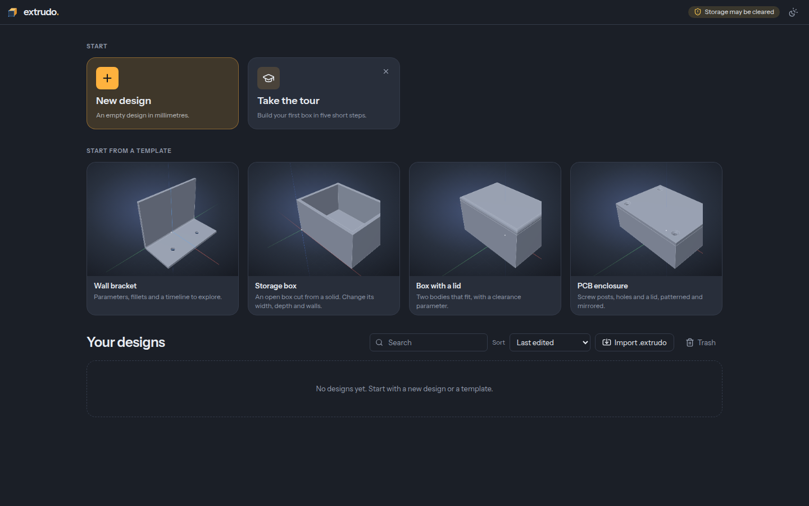
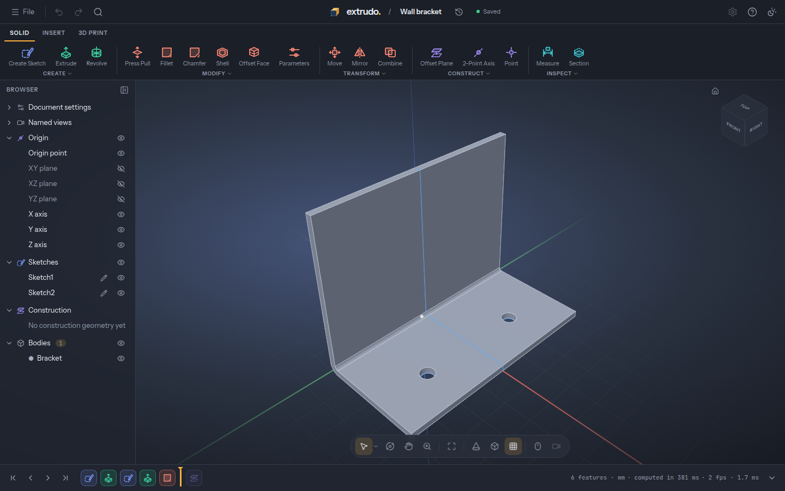

<p align="center">
  <picture>
    <source media="(prefers-color-scheme: dark)" srcset="docs/brand/extrudo-mark-dark.svg">
    
  </picture>
</p>

<h1 align="center">Extrudo</h1>

<p align="center">
  Parametric CAD for 3D printing, in your browser. Free and open source.
</p>

Sketch a profile, pull it into a solid, round the edges, and change one number
to watch the whole part follow. Extrudo is built for people who print:
brackets, boxes, clips, enclosures and the replacement part you need by
tonight. It runs in a browser tab, works offline once it has loaded, keeps your
designs on your own machine and needs no account. Under the friendly interface
sits exact geometry (real circles and fillets, not a mesh of triangles), so
what you design is what comes out of the printer.

It follows the workflow people know from desktop CAD (sketch, features,
timeline, parameters everywhere) with a faster, friendlier interface. It is
inspired by that workflow and shares no code or artwork with any such product.





> **Status:** version 0.3, "real CAD", is the stable app. Version 0.4 (import,
> threads, text, sweep and loft, the customizer and more: marked _0.4_ below)
> is finished on the latest build and being prepared for release. The core
> modeling workflow is there and tested, but expect rough edges. Things not
> built yet are listed in [`docs/03-roadmap.md`](docs/03-roadmap.md). Please
> [report what breaks](https://github.com/zoltanf/extrudo/issues/new/choose).

## Try it

**<https://app.extrudo.org>**: nothing to install; add it to your home screen or
desktop from the browser's menu if you want it as an app. The newest features
arrive first at **<https://edge.extrudo.org>**, the latest build of `main` (it can
break). <https://extrudo.org> has an introduction and a short video.

## What it does

**Sketching.** Lines, rectangles, circles, arcs, polygons, slots, ellipses and
splines, with automatic constraints, 13 constraint types and driving
dimensions. A sketch shows how much freedom is left in it, and refuses
contradictions with a plain explanation. Trim, extend, fillet, offset, mirror,
pattern and project from other geometry; export a sketch as SVG or DXF.
_0.4:_ control-point splines and conics, text in the bundled fonts or your own,
and SVG or DXF drawings imported into a sketch.

**Solids.** Extrude (with taper, symmetric, to an object, join, cut), revolve,
box, cylinder, sphere and torus, fillet and chamfer with a diagnosis when a
size does not fit, shell, holes (counterbore, countersink, M2 to M8 presets,
heat-set inserts), combine, move and copy, mirror, rectangular, circular and
path patterns, split body, scale, draft, press/pull and offset face.
_0.4:_ sweep, loft and coil, modeled threads (ISO metric, UNC, UNF) that fit
the hole or shaft they are put on, emboss and deboss onto flat and round faces,
ribs, variable-radius fillets, up to 32 fillet and chamfer sets with in-view
handles, and patterns that skip single instances.

**Import** (_0.4_). STEP files as solid bodies; STL, 3MF and OBJ meshes as
bodies you can still cut, join, move and split; pictures on a plane to trace
over. On the latest build: OpenSCAD files (`.scad`), compiled in the browser,
whose customizer variables can follow your design's parameters.

**Construction geometry.** Offset, angled, mid and three-point planes, tangent
planes, axes through points, cylinders or edges, and points.

**Parameters and the timeline.** Every number takes an expression with units
(`wall * 1.5 + 2 mm`) and named parameters. The design is an ordered timeline:
roll back, edit, reorder, suppress, and fix references when something it
pointed at is gone. Faces and edges keep their names through edits (topological
naming), so changing an early feature rarely breaks a later one. _0.4:_ a
customizer with sliders and named configurations, and timeline groups.

**For printing.** Export STL, 3MF (with colours) and STEP; checked for
watertightness. Place on Bed, overhang analysis, weight and filament length
for your material, and section analysis. Measure distances, angles, areas and
volumes exactly. _0.4:_ one print tolerance that hole presets and threads
follow, and a print estimate with walls, infill and cost.

**Everywhere else.** Version history with restore, a command palette (`Ctrl+K`),
a right-click marking menu, light and dark themes, a built-in tutorial and
templates, undo that covers everything, offline use, and an open
[file format](docs/file-format.md). _0.4:_ a folder on your disk linked to your
designs, in browsers that allow it (Chrome, Edge).

**From code.** [`@extrudo/api`](docs/api/README.md) builds and changes a design
from TypeScript — a sketch, a solid, a parameter, a reference to a face — with
the same commands the app uses, so a script and a person end up with the same
design. Pure TypeScript: no DOM, no WASM. It runs in Node, in a worker and in the
browser; the reference is published at
[extrudo.org/docs/api/](https://extrudo.org/docs/api/).

**Scripts.** A TypeScript or JavaScript program in one timeline feature, with a
CodeMirror editor, parameter completion, inline errors and console output.
Programs run in a bounded QuickJS sandbox inside the geometry worker; the bodies
they make are ordinary bodies you can fillet, measure and export.
See the [script guide](docs/api/scripts.md).

## Build from source

You need Node 24 or newer and pnpm 12 (see [pnpm.io](https://pnpm.io/installation)).
The two WASM builds (the OpenCascade geometry kernel and the sketch solver) are
not in git: `pnpm dev`, `pnpm build` and `pnpm check` download the build that
matches your checkout from this repository's releases, using the
[GitHub CLI](https://cli.github.com/) (`gh auth login` once) or a plain
download when the repository is public.

```sh
git clone https://github.com/zoltanf/extrudo.git
cd extrudo
pnpm install
pnpm dev          # the app at http://localhost:5173
pnpm check        # typecheck, lint, package boundaries and unit tests
pnpm e2e:install  # once: download Playwright's Chromium
pnpm e2e          # build, then the end-to-end tests
```

`pnpm wasm` fetches the WASM on its own. Building it yourself (Docker, about
15 minutes for OpenCascade) is described in
[`packages/kernel/occt/README.md`](packages/kernel/occt/README.md) and
[`packages/sketch/planegcs/README.md`](packages/sketch/planegcs/README.md).

### The command line

The same kernel, the same solver and the same document model run in Node, so a
design can be recomputed and exported without a browser — for a batch of
variants, a CI check or a make rule:

```sh
pnpm extrudo info   bracket.extrudo --json
pnpm extrudo export bracket.extrudo --format 3mf --param width=160mm
pnpm extrudo set    bracket.extrudo --config Large --out bracket-large.extrudo
pnpm extrudo check  bracket.extrudo      # exits 2 when a feature has an error
```

[`docs/cli.md`](docs/cli.md) has every command, option and exit code, and
`@extrudo/cli` is the library behind it for anything a script wants to do
itself.

## How it is built

TypeScript, React 19, Vite, three.js, Radix and Tailwind. The geometry kernel
is OpenCascade compiled to WebAssembly and runs in a Web Worker, behind a small
C++ facade of our own; sketches are solved by planegcs (FreeCAD's solver) in
WASM. The design is plain JSON; geometry is always derived from it, never
stored.

| Path | What |
|---|---|
| `apps/web` | The web app (React, Vite, service worker). A desktop build will wrap it later. |
| `packages/core` | Document model, parameters, expressions, undo. No DOM, no WASM. |
| `packages/sketch` | Sketch model, constraint solver adapter, profiles, SVG and DXF export |
| `packages/kernel` | Geometry kernel (OpenCascade WASM) in a Web Worker, recompute engine |
| `packages/io` | STL, 3MF, SVG and DXF readers and writers (MIT) |
| `packages/storage` | Local project storage (OPFS and IndexedDB) |
| `packages/api` | The public document API, `@extrudo/api`: a design from code, no DOM and no WASM |
| `packages/cli` | The headless CLI `extrudo`: recompute a design and export it in Node ([docs](docs/cli.md)) |
| `packages/script` | QuickJS sandbox for Script features, with bounded time, memory and output |
| `apps/site` | The landing page and the API docs, static pages built from `docs/` |
| `e2e/` | Playwright end-to-end tests |
| `docs/` | Requirements, architecture, roadmap, UI spec, brand, file format, decision records |
| `docs/api/` | The API reference: the guide pages here, the per-feature pages generated |

Start with [`docs/02-architecture.md`](docs/02-architecture.md), then the
[roadmap](docs/03-roadmap.md) and the [decision records](docs/adr/).

## Contributing

Bug reports, ideas, models that break the kernel and pull requests are all
welcome. Read [`CONTRIBUTING.md`](CONTRIBUTING.md) first, and please follow the
[Code of Conduct](CODE_OF_CONDUCT.md). Security problems go through GitHub's
private reporting, see [`SECURITY.md`](SECURITY.md).

## License

Extrudo is free software under the [GNU GPL v3.0 or later](LICENSE).

- `packages/io` and the [file-format specification](docs/file-format.md) are
  under the [MIT license](packages/io/LICENSE), so any tool can read and write
  Extrudo files.
- The OpenCascade and planegcs WASM files are LGPL-2.1 components built from
  their own sources; [`NOTICE`](NOTICE) lists every third-party component, its
  license, and where the corresponding source is.
