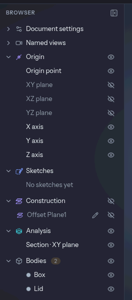

# Bodies and the browser

A **body** is one solid piece of the model: the thing you would hold in your hand once it is
printed. Sketches and construction geometry are not bodies, and neither is a fillet or a hole.
Those change a body that is already there.

## When a feature makes a body

Features that build material start one when they have nothing to join:
[Extrude](./tools/extrude.md), [Revolve](./tools/revolve.md), [Sweep](./tools/sweep.md),
[Loft](./tools/loft.md), [Coil](./tools/coil.md) and the primitives ([Box](./tools/box.md),
[Cylinder](./tools/cylinder.md), [Sphere](./tools/sphere.md), [Torus](./tools/torus.md)). An
imported STEP or mesh file makes one body per solid in it. Their **Operation** decides what
happens when the new material meets an existing body: **New body**, **Join**, **Cut** or
**Intersect**. Extrudo proposes one from where you started, as described in
[features and the timeline](./features-and-timeline.md).

Features that change a body keep it as it is: [Fillet](./tools/fillet.md),
[Chamfer](./tools/chamfer.md), [Shell](./tools/shell.md), [Hole](./tools/hole.md) and
[Thread](./tools/thread.md) edit the bodies they touch.

Two things can turn one body into several. A cut that severs a part gives you one body per
piece. [Split Body](./tools/splitBody.md) does it on purpose. In both cases the largest piece
keeps the original body's name, colour and place in the browser, and the others get the next free
names.

Names are `Body1`, `Body2` and so on, in the order the bodies first appeared, and a number is
never reused, even after you delete the body. Rename them to something you will recognise;
the names go into the files you export.

## The browser

The browser is the panel at the left of the view. Each folder has a small eye in its header
that hides or shows everything in it, and a right-click menu with **Collapse** and **Hide all** (the Bodies folder's also has
**Export all bodies…**).

- **Origin** holds the origin point, the three origin planes and the three axes. The planes
  start hidden. The eye shows them in the view.
- **Sketches** lists every sketch. A sketch that a feature has used is hidden, and the eye shows
  it again.
- **Construction** lists the planes, axes and points you made with the
  [Construct](./tools/index.md) tab.
- **Bodies** lists the bodies, with the number of them on the folder.
- **Analysis** appears only while you have a section, overhang or wall-thickness check running,
  and gives each its own eye. See [getting it printed](./printing.md).
- **Canvases** appears when the design has a [Canvas](./tools/canvas.md) picture.

Two more folders, **Document settings** and **Named views**, sit collapsed at the top. The first
shows the design's unit.

While a design opens, the Bodies folder shows the bodies the last session made as faint rows
and the view says "Preparing your design…". They turn solid when the model has been computed.

## Working with a body

A click on a row selects the body. `Shift`-click adds more, and the selection works as it does
in the view: a tool you start next has the bodies already filled in. Selecting from the row is
the easiest way to pick a body that is hidden inside another one.

Right-click a row, or press `F2` on it, to reach:

- **Rename** (`F2`).
- **Show Body**, **Show as Ghost** or **Hide Body**, the states the body is not in (the same as
  the eye). A **ghost** is a grey see-through shape that takes no part in picking, Fit or the
  print checks — handy to keep a body in sight without having it in the way. A hidden body is
  not drawn at all, and the print checks leave it out.
- **Appearance…**, a panel with nine swatches (Default, Blue, Teal, Green, Amber, Coral, Pink,
  Violet, White, Charcoal) and a field for any hex colour, plus an opacity of **Opaque**, 75 %,
  50 % or 25 %. Opacity helps when you want to see a body inside another. Both are stored with the body in the design.
- **Export…**, which opens [Export Model](./printing.md) with the body ticked.
- **Delete** (`Del`). Deleting adds a step to the timeline rather than erasing
  anything, so `Ctrl+Z` brings the body back.

A body row's eye steps through **shown → ghost → hidden** and back, so one click is always the
next faintness; the folder's eye above them still just shows or hides every body.

A colour you give a body goes into a 3MF or STEP file when you export it. A body imported from a
STEP file that names a colour starts with that colour.

## Working with several bodies

These tools are in the **Transform** group of the Modify tab. Select the bodies first and they
fill in.

- [**Combine**](./tools/combine.md) joins, cuts or intersects. The first body is the
  **Target** and the rest are the **Tools**. The tools are used up unless you tick **Keep
  tools**. Use it to make two bodies one, or to cut a shape out of another.
- [**Move/Copy**](./tools/move.md) (`M`) moves and turns bodies: free, about an axis, or point
  to point, with arrows and rings in the view. **Create copy** leaves the original.
- [**Mirror**](./tools/mirror.md) reflects bodies about a plane or a flat face. It makes a
  copy by default, and **Join** fuses the copy and the original.
- [**Split Body**](./tools/splitBody.md) cuts bodies along a plane or flat face. **Keep** says
  whether you want both sides or one.
- [**Scale**](./tools/scale.md) enlarges or shrinks about a point, by one factor or one per
  axis.

## Mesh bodies

A mesh file (STL, 3MF, OBJ) or an OpenSCAD file comes in as a **mesh body**, tagged **Mesh** in
the browser. It is a net of triangles, not a set of exact surfaces, so it has one face and no
edges you can pick. The creases where the triangles bend sharply are drawn but cannot be
selected.

What works on a mesh body: moving, mirroring, scaling, splitting, measuring, exporting as STL
or 3MF, and joining or cutting with other bodies. Cutting a solid with a mesh, or the other way
round, makes a mesh body of the result, and Extrudo warns you when a solid turns into one.

What does not: anything that needs an exact face or edge. [Fillet](./tools/fillet.md),
[Chamfer](./tools/chamfer.md), [Shell](./tools/shell.md), [Thread](./tools/thread.md), Draft,
Hole, Place on Bed and Rib stop with a message that names the operation. A STEP file cannot hold
a mesh, so the **Export Model** dialog disables mesh bodies when STEP is chosen.

A mesh has to be closed (watertight) to import. If it is not, Extrudo says how many edges are
open and suggests repairing it in your slicer first. Where two parts touch along an edge or at a
corner — an STL of patterned arms that meet a hub, say — Extrudo separates them itself and says
how many edges it split, so they come in as separate bodies that still touch.
