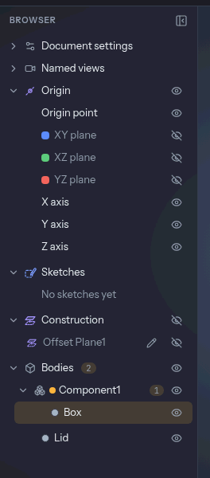

# Components and joints

A **component** is a named set of bodies: a lid, a base, a hinge leaf. Components organise a
design with more than one part, hide and show a part as a unit, export it as one piece and carry
it through placement. They are not a second modelling space. The design still has one
[timeline](./features-and-timeline.md), and a feature in one component can refer to the faces of
another.

A component stores **no position**. Where its bodies are is where the timeline put them.

## Making and using components

Solid › Component has **New Component**. With bodies selected it gathers them into a component
named `Component1`, `Component2` and so on. With none selected it makes an empty one. A body's
right-click menu has **Move to Component** (a component, a new one, or none), and in the
[browser](./bodies.md) a body row can be dragged onto a component row, or onto the Bodies
header to leave it.

In the browser a component is a folder inside Bodies with a count, an eye and a menu. Clicking
its row selects all of its bodies. Its eye cycles shown, ghost and hidden, and the body keeps its
own state underneath, so showing the component again restores what you had. `F2` renames it.

**Isolate** in a component's menu draws and picks only that component, with a bar over the view
that says "Showing Lid only" and an **Exit isolation** button.

## The active component

**Activate** in a component's menu makes it the active one: the status bar says "Active: Lid",
and every feature you create from then on belongs to it. Nothing is dimmed, so the other
components stay pickable and you can model in context. Deactivate from the same menu or the
status bar. The active component is not saved with the design.

## Where new bodies go

A new body joins the component of the feature that made it. A piece broken off a body by a cut or
by Split Body joins the component of the body it came from. Anything else is loose. Editing a
feature never changes the component it belongs to. Move a body by hand and the move is remembered.

## Pieces and copies

- **Pieces** (a cut that severs a part, Split Body) stay in the component of the original.
- **Copies** (Copy Component, a pattern or a mirror with copies) are new bodies that follow the
  rule above. Copy Component makes the copy and a component named "Lid (2)" in one undo step.

## Moving and placing

Because a component has no transform, **Move Component** is the [Move](./tools/move.md) tool
opened with the component's bodies selected. **Copy Component** is the same with *Create copy*
on. [Patterns](./tools/rectangularPattern.md), Mirror and Scale take a component too: select its
row and the tool is filled in.

**Place Component on Bed** (the context list on a flat face of a body in a component) lays the
face on the bed and carries the component's other bodies along with it, as one.

### Assembled to check, laid out to print

One timeline holds one position. To see the parts assembled and to print them laid out, put the
layout at the end of the timeline as a group:

1. Model the parts where they fit together.
2. Add the Move and Place on Bed features that lay them out on the bed.
3. Select those chips and **Group** them, naming the group "Print layout".
4. Suppress the group to see the assembly, unsuppress it to print.

Joints are made and checked on the assembled position, so suppress "Print layout" before using
them.

## Export and print

The [Export dialog](./files.md) lists bodies under their components, and a component's heading
chooses all of its bodies. With **Keep components together** on (the default):

- a **3MF** holds each component as one object made of several parts, which a slicer shows as
  one part with several bodies, each able to take its own filament;
- a **STEP** file holds each component as an assembly whose children are its bodies;
- STL has no structure, so the bodies are concatenated.

A component's menu has **Export Component…**. With the option off every body is exported alone.

[Print Info](./printing.md) keeps its totals and, when the design has components, adds a row per
component under them: its weight, filament length and cost, from the bodies the totals count,
and a "Loose bodies" row when some bodies are in none.

## Joints

A joint says how one component moves against another, so you can see the motion and check its
clearance before you print. Joints are **as built**: you pick a frame on each of two components
where they already are, and nothing moves. There are three types:

- **Rigid**: the two move as one, which carries a part made of several components along.
- **Revolute**: the moving side turns about an axis, between two angle limits or a whole turn.
- **Slider**: the moving side moves along a direction, between two length limits. A slider needs
  both limits to be posed or checked.

### Making one

**Joint** (`J`, Solid › Component) opens the dialog. Choose the Type, pick the **Moving part** and
the **Fixed part** (a cylindrical or conical face, a circular edge, a straight edge, an axis or a
sketch line for a revolute; a flat face, an edge, an axis or a sketch line for a slider), and set
the limits. Pick a body that is in no component and the dialog tells you to put it in one first.
OK adds the joint in one undo step. Its row sits under the moving component in the browser.

The axis or direction is read from the fixed side, and the moving side's frame has to agree with
it as built. If it doesn't (a layout move has laid the parts apart), the joint shows a warning
and is not posed or checked until you suppress that move.

### The pose

A joint row's **Pose…** opens the Joint panel: a slider and an angle or travel field, with a
handle in the view. The moving components (and anything a rigid joint carries with them) are drawn
turned or moved, and a bar says the design is unchanged.

A pose is a **look**, not a change. It isn't saved, can't be undone and recomputes nothing. Posed
bodies can't be picked, and starting any tool or dialog puts everything back, so you can never
model against a body that is drawn somewhere it isn't. To keep a position, move the component with
Move.

### The clearance check

**Check clearance** in the Joint panel samples the joint's whole range and measures, at each
pose, the smallest distance between the moving bodies and every other body, hidden or ghosted
ones included. It reports the tightest gap and any collision:

- "Tightest gap 0.18 mm at 72°"
- "Collides from 64.2° to 81.0° (3.2 mm³ at 72°)"

The result is measured against a **Minimum gap**, which starts at the design's `tolerance`
parameter when it has one (see [print tolerance](./printing.md)) and 0.2 mm otherwise. Each line
has **Show**, which poses the joint there. The tightest pair of points gets a leader in the view
and the colliding faces turn red.

### A print-in-place hinge

1. Model the base plate with two knuckles and the leaf with its own knuckle between them, each
   as its own component, with a pin gap of 0.4 mm all round.
2. Make a revolute joint: Moving part is the leaf's knuckle face, Fixed part the base's pin
   face, limits 0° to 180°.
3. **Check clearance**. The result is the tightest gap along the swing. If it reads "Collides
   from 140.1°", the leaf's edge reaches the base plate there; give it room or limit the joint.
4. Set a `tolerance` parameter (the 3D Print tab's Tolerance panel) and the check measures against
   it, so a hinge that prints with a loose printer and one with a tight one are judged differently.

On a 130-face hinge the whole turn takes about 16 s, with progress and a Cancel button.

## What isn't there

- A pose that moves the design. A joint's value never becomes a Move.
- Motion studies and animation, several joints posed at once, and joint limits that stop a drag at
  contact.
- Joint types beyond rigid, revolute and slider (cylindrical, ball, planar, pin-slot).
- Joints inside a nested component, and components inside components.
- An automatic plate layout. Use the "Print layout" group above.
