# Examples

Eleven designs to open, take apart and change. Each opens as your own copy
in the app: nothing you change touches the original. They are the models
Extrudo's own tests build, so they always work with the current version.

## Beginner
### Plate with corner holes
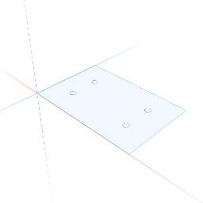

The sketch of a plate whose width, depth and hole spacing are parameters, ready to extrude.

Shows: sketch, constraints, dimensions, parameters.

[Open in Extrudo]({{APP_URL}}/#/example/plate)

### Storage box
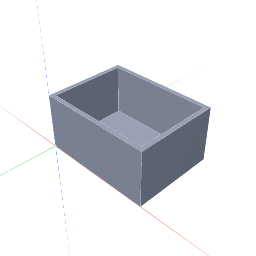

An open box cut from a solid, with its walls offset from the outline.

Shows: extrude, cut, sketch on face.

[Open in Extrudo]({{APP_URL}}/#/example/storage-box)

### Phone stand
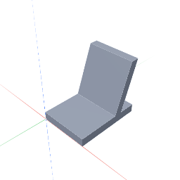

Two bodies combined into one stand.

Shows: extrude, bodies, combine.

[Open in Extrudo]({{APP_URL}}/#/example/phone-stand)

### Name tag
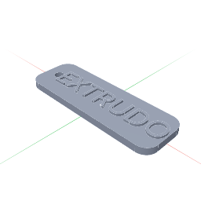

A key tag with embossed text and rounded corners.

Shows: text, emboss, fillet.

[Open in Extrudo]({{APP_URL}}/#/example/name-tag)

## Intermediate
### Box with a lid
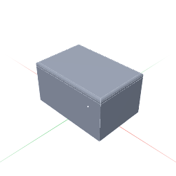

A box and a lid that fits it, sized by one clearance parameter.

Shows: shell, fillet, chamfer, two bodies.

[Open in Extrudo]({{APP_URL}}/#/example/box-with-lid)

### PCB enclosure
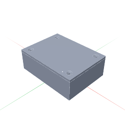

Screw posts, countersunk holes and a lid, patterned and mirrored.

Shows: hole, pattern, mirror, shell.

[Open in Extrudo]({{APP_URL}}/#/example/pcb-enclosure)

### Wall hook
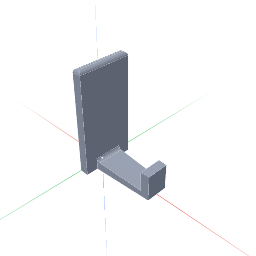

A hook with a drafted arm and fillets where edges meet.

Shows: draft, fillet.

[Open in Extrudo]({{APP_URL}}/#/example/wall-hook)

### Knurled knob
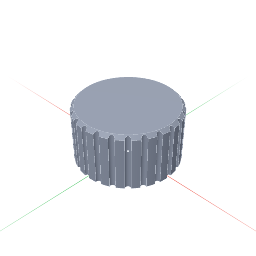

A turned knob with a knurl from a circular pattern.

Shows: revolve, circular pattern, chamfer.

[Open in Extrudo]({{APP_URL}}/#/example/knurled-knob)

## Advanced
### Threaded bottle cap
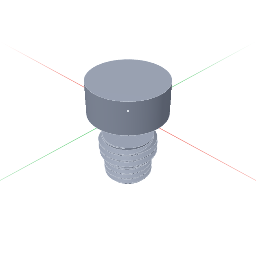

A cap and an adapter with modelled threads that fit.

Shows: thread, revolve, shell.

[Open in Extrudo]({{APP_URL}}/#/example/bottle-cap)

### Cable chain link
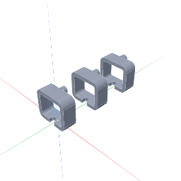

A swept link patterned into a chain, with a tolerance parameter.

Shows: sweep, pattern, tolerance.

[Open in Extrudo]({{APP_URL}}/#/example/chain-link)

### Sweep, loft and coil
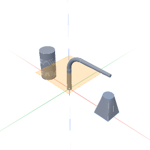

One of each: a swept tube, a lofted transition and a spring.

Shows: sweep, loft, coil.

[Open in Extrudo]({{APP_URL}}/#/example/sweep-loft-coil)
