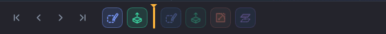

# Features and the timeline

A design in Extrudo is a list of steps, not a lump of geometry. Each step is a **feature**: a
sketch, an extrude, a fillet, a hole. The list is the **timeline**, along the bottom of the
window. The model is what you get by running the steps in order, which is why you can go back,
change one and watch the rest follow.

## What a feature is

A feature is a tool you ran, with the choices you made: which profile, how far, which edges.
Extrudo keeps those choices, not the shape. When you change one, it runs the steps again. That
is why a number you edit in step 2 can move a fillet made in step 7.

Each feature is a chip on the timeline, coloured by kind and named after what it is: `Sketch1`,
`Extrude1`, `Fillet1`.

## The dialog pattern

Nearly every feature tool opens the same kind of dialog, a floating panel at the top right of
the view. You can drag it by its title. Nothing is committed until you press **OK**.

- **Pick fields** are buttons: **Profiles**, **Faces**, **Edges**, **Axis**. The one that
  takes your clicks has an amber outline. Click in the view to add or remove an item, or drag a
  box. Only what the field accepts lights up. Select things before you choose the tool and the
  dialog opens with them filled in.
- **Expression fields** take a number, a unit or an [expression](./parameters.md): `20`,
  `20 mm`, `wall * 2`.
- **Handles in the view** do the same job as the fields: an arrow for a distance, an arc for an
  angle. Drag one, or type straight into the value box beside it. The field follows.
- **A live preview** shows the result as you change things. New material is tinted blue, a cut is
  red, and a join is green. If a value can't work, the field shows the message under it and the
  preview stays on the last good result, dimmed.
- **OK** commits one undo step and adds the chip. **Cancel**, or `Esc`, closes the dialog and
  changes nothing.

Some tools also have a key (`E` for [Extrude](./tools/extrude.md), `F` for
[Fillet](./tools/fillet.md), `H` for [Hole](./tools/hole.md)). Press `Q` for
[Press Pull](./tools/pressPull.md), which opens whichever dialog fits what you selected: a
profile extrudes, a face offsets and an edge fillets.

## New body, join, cut

Extrude and Revolve have an **Operation**: **New body**, **Join**, **Cut** or **Intersect**.
You usually don't have to set it. Extrudo proposes one from where the profile is: a profile out
in the open makes a new body, one on a face that grows outwards joins that body, and one that
goes into the material cuts it. Change it if the guess is wrong.

Each solid is its own body, listed in the browser. If a cut splits a part in two, you get two
bodies, and the larger keeps the name and colour.

## Editing a feature

Double-click its chip, or right-click it and choose **Edit Feature**. The dialog opens with the
feature's choices. While you edit, the timeline marker shows dashed after the chip and later
chips dim, and the model in the view is what the feature would give. OK applies it, and every step
after it runs again.

Double-clicking a sketch chip opens the sketch instead.

## The timeline

**The marker** is the amber bar between chips. Features before it are in the model, and features after it are
dimmed and not computed. Drag the marker to roll the model back. Focus it and use the arrow keys,
`Home` and `End`, or use the playback buttons at the left (roll back to start, step back, step
forward, roll forward to end). Right-click a chip and choose **Roll Back to Here** to put the
marker just after it.

New features always go in at the marker. Roll back, add a feature, and it lands in the middle
of the history, with the later ones recomputed on top. Moving the marker is one undo step.

**Reordering.** Drag a chip to move it; a line shows where it will land. The line turns red, with
the reason, if the move would put a feature before something it uses. A fillet can't move before
the extrude that made its edges. Dropping there tells you why in a message, and `Esc` puts the
chip back. Click one chip and `Shift`-click another to pick a run, and drag any of them to move
the lot. **Move to End** in the menu does the same without dragging.

**Suppress and hide.** **Suppress** turns a feature off without deleting it: its chip dims and the
model is computed without it. Choose it again to bring it back. **Hide** hides a sketch's curves
in the view without changing the model (a body is hidden with its eye in the browser). **Delete** removes a feature, but
refuses while a later one uses it, and tells you which.

**Groups.** Pick a run of neighbouring chips, right-click, and choose **Group 3 features**. A group
folds into one chip with a count. Open it with the arrow beside it. `F2` renames it, and its menu
has **Ungroup**, **Hide** and **Suppress** for the lot. Groups are only for tidiness: they don't
change what is computed.

## When a reference is lost

A fillet remembers which edge it rounds. If you change an earlier step so that the edge is gone,
the fillet can't do its job. Extrudo tells you in three places: the chip gets a ✕ (or a ⚠ when it
could carry on, for instance with a reference it had to guess), the status bar counts the errors,
and the notification history (the bell at the foot of the view) lists them. Hover the chip for the
message.

For a ⚠, the chip's menu has **Keep Closest Match**, which accepts the edge Extrudo picked and
stops warning. For a ✕, choose **Fix References…**: the feature's dialog opens with the lost
picks removed and the field waiting for a new one. For a sketch it is **Redefine Plane**, which
asks for a new plane or face.

While you hover the chip, or while Fix References is open, the lost geometry is drawn as a
dashed red ghost where it used to be, so you can see what it was and pick its replacement.

## Why a name survives an edit

Extrudo doesn't remember a face as "face number 7", because numbers shift whenever something
before it changes. It remembers a face by how it came to be: "the end cap of Extrude1" or "the
side made by that line of Sketch1". Change the sketch, move the extrude's distance or add a
feature in between and that description still finds the same face. When it can't find an exact
match it looks for the face most like the one you picked, and warns you so you can accept or
fix it. Only when nothing is close does the feature fail.
