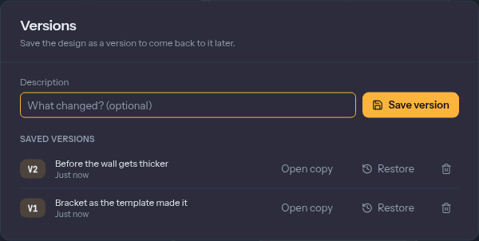

# Files, versions and where your work lives

Extrudo has no account and no server that holds your designs. In the browser they live in the
browser's own storage; on the desktop they are files in a folder the app owns. This page covers
how that works, how to take a design out and bring one in, and how to keep earlier states of it.

## Autosave

You never press Save. A moment after each change, the design is written to your browser's
storage, and the word beside its name in the top bar goes from **Edited** through **Saving…** to
**Saved**. If a write fails, it reads **Couldn't save**. Treat that one as a prompt to export the
design, because it means the browser could not keep it.

Closing or reloading the tab in the middle of a write is covered too. When the page is hidden
with unsaved changes, Extrudo also keeps a rescue copy in a place that writes instantly, and the
next time the app starts it saves that copy as the design. Your last edit survives a reload.

Browsers may clear a site's storage when the disk is nearly full. The home screen says
**Stored on this device** when the browser has promised not to, and **Storage may be cleared**
when it has not. In the second case, export the designs you care about.

## Taking a design out: Export Design

**Home › Files › Export Design** downloads the design as an `.extrudo` file. It is the whole
design: the timeline, parameters, bodies' names and colours, any fonts or files you imported,
the thumbnail, and every saved version. Import it on another machine or in another browser and
you have the same design.

The format is open. It is a zip archive with the design as JSON inside, and
[`docs/file-format.md`](https://github.com/zoltanf/extrudo/blob/main/docs/file-format.md) in the
repository describes every field. A design saved by an older Extrudo still opens in a newer one.
A design saved by a newer one opens too, and Extrudo tells you if it had to leave out something
it does not know.

**Home › Files › Export as Script** writes the design as TypeScript that rebuilds it, which is
useful if you want to turn a design into a program. See the
[API reference](../api/README.md).

## Bringing things in

All of these are in **Home › Files**.

- **Import Design** opens an `.extrudo` file as a new design. The home screen's **Import
  .extrudo** button does the same.
- **Import Model** brings in a STEP file, an STL, 3MF or OBJ mesh, or an OpenSCAD `.scad`
  file, as bodies in the current design. A STEP file keeps its exact surfaces. A mesh becomes a
  [mesh body](./bodies.md) and must be closed. An OpenSCAD file is compiled in your browser, and
  its customizer variables show up as fields you can change. The **Up** setting says whether the
  file's up is Z or Y, and a mesh has a **Units** setting.
- **Import Drawing** needs an open sketch. It reads an SVG or DXF file and adds its lines and
  curves to the sketch, at the **Scale** and **Units** you choose. **Fixed** (on by default)
  pins the curves where they are, so they do not move when you add constraints.
- **Canvas** lays a picture on a plane for you to trace. **Calibrate** sets its real size from
  two clicks and the distance between them.

The imported file is stored inside the design, so exporting the design carries it along.

## Version history

A version is a named snapshot kept inside the design. Press `Ctrl+S`, or open **Home ›
Versions › Version History** or the clock beside the design's name, to reach the **Versions**
dialog.

- **Save version** keeps the design as it is, with an optional **Description** (`Enter` saves).
  The dialog closes and a message says **Saved V1.** Open it again to see the list.
- **Restore** brings an older version back into the design. The state you had is saved as a
  version first, and one `Ctrl+Z` undoes the restore.
- **Open copy** opens the version as a new design and leaves the current one alone. Use it when
  you want to take a different direction without losing the first.
- The bin button deletes one version. After ten, **Delete older versions** offers to keep the
  newest ten.

Versions are not backups against losing the browser's storage. They live in the same place as
the design, but they travel with the `.extrudo` file.

## Linked folders

Browsers that allow it (Chrome and Edge) can keep a copy of your designs as real files. On the
home screen, **Linked folder › Link a folder…** asks you to choose a folder. From then on:

- the folder's `.extrudo` files are listed on the home screen, and clicking one opens it;
- **Home › Files › Save to Linked Folder** links an open design to the folder;
- a linked design is written to its file after each autosave, at most every ten seconds.

The browser's own copy stays the main one. If the folder is unreachable (the browser can lose
permission after a restart), the home screen shows **Reconnect**. If the file changed on disk
since Extrudo last wrote it, nothing is overwritten. A message says the file changed, and you
choose **Load from disk** or **Overwrite**. **Unlink the folder** leaves the files where they are.

This is handy for keeping designs in a synced folder, or in a repository. Firefox and Safari do
not offer folder access, and there the tile and the section are not shown.

## Offline, and updates

After your first visit, Extrudo keeps itself in your browser, so it opens without a connection,
and the CAD kernel is already there. The one exception is OpenSCAD import, which downloads its
compiler the first time you use it. After that it works offline too.

When a new version of the app is out, a message says **A new version of Extrudo is ready.** with
a **Reload** button. Nothing changes until you press it, so you will not lose work to a surprise
reload. Reload first saves every open design, and stops if a save failed.

## Examples

The home screen's **More examples…** lists designs to open, take apart and change. Each one
opens as your own copy. The same designs are on the [examples page](./examples.md), where
**Open in Extrudo** goes to `#/example/<name>` in the app, for instance `{{APP_URL}}/#/example/plate`.
The link is not left in your history, so Back goes to where you were before it.

If you would rather be guided, start with the [first tutorial](./tutorials/first-part.md).
