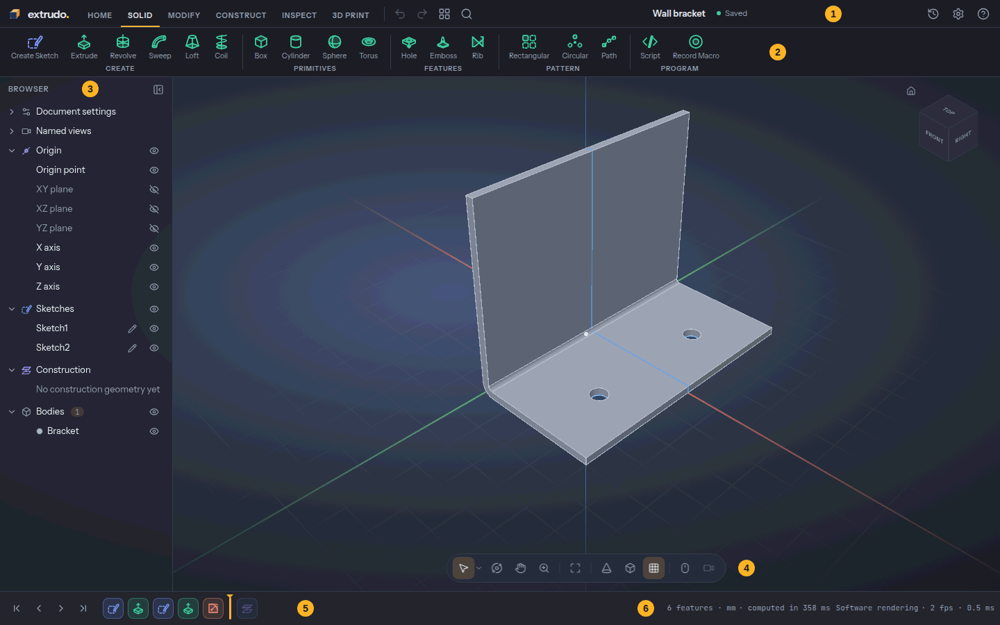

# The app in five minutes

This page shows you where everything is. The next ones go deeper:
[sketching](./sketching.md), [features and the timeline](./features-and-timeline.md)
and [parameters](./parameters.md).

Where a key is written with `Ctrl`, it is `⌘` on a Mac.

## Opening it

Open [{{APP_URL}}]({{APP_URL}}/) in a current Chrome, Edge, Firefox or Safari. There is
nothing to install and no account. After the first visit the app is kept in your browser, so
it also opens without a connection.

There is a desktop app too, with the same screens: an AppImage or deb on Linux, an installer
on Windows and a dmg on macOS (also `brew install --cask zoltanf/extrudo/extrudo`). It opens
`.extrudo` files from your file manager and updates itself, except as a deb or on macOS.

## The home screen

You start on the home screen:

- **New design** opens an empty design in millimetres.
- **Take the tour** builds a first box in five short steps, with a card that follows what you do.
- **Start from a template** opens a copy of the Wall bracket, Storage box, Box with a lid or
  PCB enclosure. They have parameters and a timeline to poke at, which is a good way to see how
  a finished design is put together.
- **More examples…**, under the templates, lists further designs. Each one opens as a copy you can edit.
- **Your designs** lists what is stored in this browser, with search and sorting.
  **Import .extrudo** adds a design from a file.

## The layout

1. **The top bar** has the logo (back to the home screen), the tabs, **Undo**, **Redo**,
   **Toolbox** and **Search commands**, then the design's name with its save state, **Version
   history**, **Settings** and **Help**.
2. **The toolbar** shows the groups of the selected tab. In a model the tabs are Home, Solid,
   Modify, Construct, Inspect and 3D Print; while a sketch is open they are Home, Sketch and 3D
   Print. Home holds what concerns the whole design: files, versions, parameters, plugins.
   When a group has more tools than fit, the rest are under its ▾ menu.
3. **The browser** lists the origin, sketches, construction geometry and bodies. The eye hides
   or shows an item, a click selects it, and `F2` renames.
4. **The view** is where the model is. The ViewCube in its corner turns the model, and the
   navigation bar under it holds Select, Orbit, Pan, Zoom, Fit, Orthographic, the visual
   style, the grid and the mouse controls.
5. **The timeline** is the row of chips along the bottom: one per sketch or feature, in the
   order they were made. See [features and the timeline](./features-and-timeline.md).
6. **The status bar** is at the right end of the same row: how many features there are, the
   unit, whether the model is computing, and what your selection measures.

The save state next to the name reads **Saved**, **Saving…**, **Edited** or **Couldn't save**.
It shows a word when there is room; when the bar is narrow it drops to the dot, and the
word is in the dot's tooltip.

## Moving the view

The default mouse controls are:

| To | Do this |
|---|---|
| Orbit | Drag with the middle button |
| Pan | Drag with the right button |
| Zoom | Turn the wheel (it zooms towards the pointer) |
| Fit everything | `F6` |
| Fit what is selected | Ctrl+K, **Look at Selection**, or the right-click list |

The **Mouse controls** button in the navigation bar switches to the layout of Onshape /
SolidWorks, Fusion, Blender or a trackpad.

Seven keys jump to a named view: `Shift+1` is the home view, then `Shift+2` Top, `Shift+3`
Bottom, `Shift+4` Front, `Shift+5` Back, `Shift+6` Left and `Shift+7` Right. Clicking a face of
the ViewCube does the same. **Orthographic** in the navigation bar turns perspective off, which
is what you want when you read a position off the screen.

## Selecting

Hover to see what a click would take, click to select, and `Shift` or `Ctrl` with a click adds
to the selection or takes from it. Dragging a box from left to right selects what lies wholly
inside; from right to left it selects whatever the box touches. `Esc` clears the selection or
cancels the tool you are in.

What you can pick is set by the selection filter beside the **Select** button. If two things
lie behind each other, right-click and choose **Select other…** to pick from a list.

Selecting before you choose a tool saves work: select an edge, press `F`, and the Fillet
dialog opens with the edge already in it.

## Finding commands

There are four ways to a tool, and you will use all of them:

- **The toolbar.** Hover a tile for its name, key and, for some, a short clip.
- **The right-click menu.** Right-click without moving and a ring of eight wedges opens round the
  pointer, with a list under it that depends on what you clicked. In a model the ring has Sketch,
  Extrude, Fillet, Move, Press Pull, Undo, Repeat last and Delete; in a sketch it has Line,
  Rectangle, Circle, Dimension, Trim, Undo, Construction and Finish Sketch. A right-drag still
  pans. You can remap the wedges under **Settings › Customize Marking Menu…**.
- **`Ctrl+K`** opens a search over every command. Type a few letters of a name and press `Enter`.
- **`S`** opens the toolbox at the top bar: your pinned tools as tiles, and the same search under
  them. `Shift+Enter` on a result pins it.

Every tool has its own page in the [tool reference](./tools/index.md). The **Help** menu in the
top bar links to these pages: **User Guide**, **Tutorials**, **Examples** and **Tool Reference**
open on the docs site, and **Tutorial** starts the in-app tour. `F1` opens the page of the tool
under the pointer (hover a toolbar tile first), or the guide when the pointer is over nothing.

## Undo covers everything

`Ctrl+Z` undoes the last change and `Ctrl+Y` (or `Ctrl+Shift+Z`) redoes it. That includes
dragging a sketch point, changing a parameter, hiding a sketch, reordering the timeline and
renaming a body. A parameter that moves several sketches is still one step, and so is a whole
sketch session. The Undo button's tooltip says what it would undo.

What does not go on the undo stack is what you see rather than what you made: the camera, a
section plane and the analysis overlays.

## Where your designs are kept

A design is saved in your browser as you work, a moment after each change. The save state in the
top bar says when it is done. Nothing is sent anywhere.

A browser can clear its storage when the disk is nearly full. The home screen tells you whether
yours promised not to: **Stored on this device** is good, **Storage may be cleared** means you
should keep a copy. To keep one, use **Home › Export Design**, which writes an `.extrudo` file
you can store anywhere and open again with **Import Design** (or **Import .extrudo** on the home
screen). The file holds the whole design, with its versions.

**Ctrl+S** does not save the file; it saves a named version inside the design, which you can
restore or open as a copy from **Version history**. It is a good habit before a risky change.
