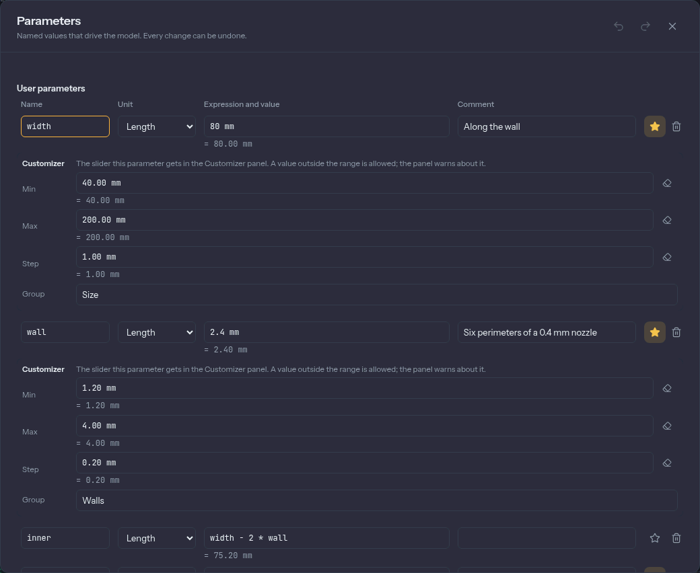

# Parameters and expressions

A design that has `wall = 2.4 mm` in one place and the number 2.4 typed in five others is hard
to change. Extrudo lets you name a value once and use the name everywhere, so changing it changes
everything that depends on it.

## Every number is an expression

Any field that takes a number takes an **expression**: a number with a unit, a parameter's name,
or a calculation. All of these work in a length field:

```
20
20 mm
wall * 1.5 + 2 mm
(width - 2 * wall) / 3
max(wall, 1.2 mm)
```

Under the field the app shows what the expression comes to, for example `= 75.20 mm`. If it
doesn't make sense, the field shows a red underline and says why, pointing at the part that is
wrong. The value isn't used until it works.

This holds in feature dialogs, in a sketch's dimension labels, in the heads-up box while you
draw and in the Parameters dialog.

## Units

The units are `mm`, `cm`, `m`, `in` and `ft` for lengths and `deg` and `rad` for angles. Write
the unit after the number, with or without a space: `10 mm`, `2.5in`, `45 deg`.

A **plain number** takes the unit of the field it is in. In a length field `20` means 20 in the
design's unit (millimetres, unless you changed it), and in an angle field `45` means 45
degrees. Next to a length, a plain number joins in too: `width + 2` adds 2 mm. This is what makes
quick typing work.

Beyond that, units have to add up. You can't add a length and an angle, and a parameter that is
just a number won't pass for a length: the app says "Multiply by a unit, like `… * 1 mm`".
There is no hidden multiplication either, so write `2 * width`, not `2 width`.

## Operators and functions

`+`, `-`, `*`, `/` and `^` (power), brackets, and `pi`. The functions are:

| | |
|---|---|
| `sin` `cos` `tan` | Take an angle. A plain number counts as degrees. |
| `asin` `acos` `atan` | Give an angle back. |
| `sqrt` `abs` | |
| `min` `max` | Take any number of values of the same kind. |
| `round` `floor` `ceil` | Round in display units: a length to a whole millimetre, an angle to a whole degree. |

## The Parameters dialog

Open it from **Home › Parameters** (it is also in the Sketch tab, since dimensions use
parameters), or search for it with `Ctrl+K`.



**User parameters** are yours. To add one, fill in the row at the bottom: a name, a **Unit**
(**Length**, **Angle** or **Number**), an expression and, if you like, a comment, then press
**Add**. Names can't be a unit, a function or `pi`. Parameters can use each other:
`inner = width - 2 * wall`. If they end up depending on themselves, Extrudo refuses and shows
the loop: "`wall` refers to itself: wall → lid_gap → wall."

**Model parameters** are the values in the design that already have names, listed under the
feature they belong to. A dimension you placed in a sketch is `d1`, `d2` and so on, and so are
the values in feature dialogs. You can edit them here, and use them in other expressions. Rename
a dimension by typing `name = value` in its editor, as described in
[sketching](./sketching.md).

Changing a parameter is one undo step, however many sketches and features it moves. Deleting one
that something uses is refused, and the message lists what uses it.

## The Customizer

The Customizer is a panel of sliders for the few parameters someone changing your design would
reach for, and none of the rest. It is how a design becomes a small configurable product.

To put a parameter there, click its star in the Parameters dialog. Under the row you can set a
**Min**, a **Max**, a **Step** and a **Group**. A parameter with a range and a plain value gets a
slider. Parameters with the same group are shown together, such as *Size* and *Walls*. The ranges
are only the slider's range: you can type a value outside it, and the panel warns that it is
outside.

Open the panel from **Home › Customizer**. Dragging a slider moves the model live, and the whole
drag is one undo step.

**Configurations** are saved sets of values. The panel's **Configuration** menu lists them, and
choosing one sets every exposed parameter at once. Under the ⋮ menu are **Save as…** (a new
configuration from the current values), **Update**, **Rename…** and **Delete**. There is no
"active" configuration stored in the design: the panel shows the one whose values the design has
right now, and **Custom** when none matches. The templates on the home screen come with some,
such as Small and Large for the Storage box.

## Print tolerance

Printers don't make parts to the exact size you draw. A hole prints a little small and a peg a
little large, so a part that has to fit another needs a clearance. Extrudo has one parameter for
it, named `tolerance`.

Set it in **3D Print › Prepare › Tolerance**: type a value, or press **Tight** (0.1 mm),
**Normal** (0.2 mm) or **Loose** (0.3 mm). The panel counts how many places use it. It is an
ordinary parameter, so you can also use `tolerance` in your own expressions.

Two features follow it by themselves:

- **[Hole](./tools/hole.md) presets** for clearance holes and heat-set inserts add the tolerance
  to every diameter they fill in. With the parameter set, the M3 clearance preset writes
  `3.4 mm + 2 * tolerance`.
- **[Thread](./tools/thread.md)** cuts its profile in by the tolerance, so a thread you cut on a
  bolt and one you cut in a nut meet with a gap. The dialog proposes the `tolerance` parameter
  when the design has one.

Without a `tolerance` parameter the presets write plain numbers and a thread uses 0.1 mm.
Change the value later and every hole and thread that follows it changes with it.
