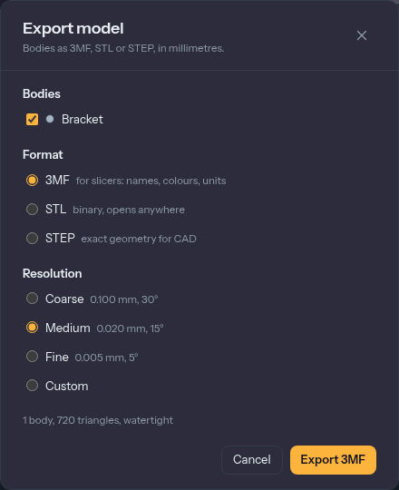
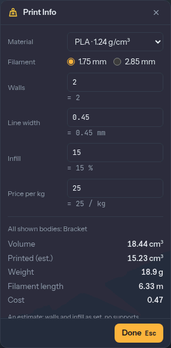

# Getting it printed

The **3D Print** tab collects what you need between a finished model and a slicer. It has two
groups: **Prepare** (Place on Bed, Measure, Print Info, Tolerance, Overhangs, Wall Thickness) and
**Output** (Export and, on the desktop app, Send to Slicer). None of the checks changes your
model. They colour it or give you numbers, so you can run them as often as you like.

## Export a model

Press **Export** in the Output group (or **Home › Files › Export Model**). The **Export model**
dialog lists the design's bodies. Tick the ones to export, or tick **All bodies**. Hidden bodies
are listed too, marked "hidden", so you can export a part you have tucked away.

Pick a **Format**:

- **3MF** is the one to use for slicers. It keeps the body names, their colours and the unit, so
  a multi-colour model arrives in your slicer already split into named objects.
- **STL** is binary and opens anywhere. It has no names or colours, and all the bodies share one
  list of triangles.
- **STEP** holds exact geometry in millimetres, for other CAD programs. It has no resolution,
  because nothing is turned into triangles. A body's colour goes into the file. Mesh bodies
  cannot go into a STEP file.

For 3MF and STL you also pick a **Resolution**, which is how closely the triangles follow a
curve:

| Resolution | Largest gap to the true surface | Largest angle between neighbours |
|---|---|---|
| Coarse | 0.1 mm | 30° |
| Medium (the default) | 0.02 mm | 15° |
| Fine | 0.005 mm | 5° |
| Custom | **Deviation**, your value | **Angle**, your value |

A printer resolves around 0.05 mm, so **Medium** is already finer than a print shows. Choose
**Fine** only for a large smooth sphere or a lens, and expect a bigger file. The dialog
remembers your format and resolution.

The line under the options tells you what you will get: how many bodies, how many triangles, the
file size, and whether the mesh is **watertight**. A slicer needs a closed surface. If a body is
not closed, the line lists which, and the slicer will try to repair it. That is rare with
bodies built in Extrudo. It happens with an imported mesh that was already broken.

**Export 3MF** (the button follows the format) downloads the file.

## Lay it flat: Place on Bed

Most prints need a flat face on the bed. [Place on Bed](./tools/placeOnBed.md) turns a body so
the face you pick lies on the floor of the model (z = 0), and drops it to the floor. Pick one
flat face per body. **Spin** then turns the body about the vertical, for when you want it
rotated on the bed.

It is a feature on the timeline, so you can change the face later, and it does not change the
body's shape. If the face is already down, it says so and does nothing.

## Print Info: weight, filament and cost

[Print Info](./tools/printInfo.md) adds up the volume of the bodies that are shown and estimates what
the print will use:

- **Volume** of the solid.
- **Printed (est.)**, the plastic actually laid down, which is less than the volume because
  most prints are hollow inside.
- **Weight**, **Filament length** and **Cost**.

Set the **Material** (PLA, PETG, ABS, TPU, or **Custom density**), the **Filament** diameter
(1.75 or 2.85 mm), the number of **Walls**, the **Line width**, the **Infill** percentage and the
**Price per kg**. The estimate counts the walls as a skin of that many lines and fills the
interior at the infill percentage. At 100 % infill it is simply the solid's volume.

These settings belong to you, not to the design. They are kept in your browser and are not
undone with `Ctrl+Z`. The estimate does not include supports, because only a slicer can
generate those, so treat the numbers as a good guess and the slicer's as the final answer.

## Overhangs

[Overhang Analysis](./tools/overhang.md) shades the faces that lean out further than an angle,
because they will need support. The **Angle** is 45° at first. **Down** says which way the bed
is: an axis, or **Use selected face** to say that a flat face you have selected is the bottom.
The panel says how many faces overhang and their area ("1 face overhang, 226 mm² in all."). Faces
lying on the bed are left out.

It shades per triangle, so a smooth curve gets a gradient rather than a hard edge. The shading
follows your edits.

## Wall Thickness

Thin walls print weak, or with gaps. [Wall Thickness](./tools/wallThickness.md) shades walls
thinner than a **Minimum**, which starts at two lines of your Print Info line width (0.9 mm
at 0.45 mm). The panel reports the thinnest wall and the area that is too thin, and a label
marks the thinnest spot.

The numbers come from the mesh you see, so a wall within a hair of the minimum can go either
way. Use it to find what to thicken, then confirm with the slicer.

## Look inside: Section Analysis

[Section Analysis](./tools/section.md) (`Shift+S`, in **Inspect**) cuts the view through a
plane and fills the cut, so you can see walls, hollows and internal features. Pick an origin
plane, a construction plane or a flat face, then drag the arrow or type an **Offset**.
**Flip** chooses which side stays. **Add plane** (shown once a plane exists) adds up to three
planes, and **Box** clips to a box instead. Box is also offered on the empty panel beside the
planes, so a box section needs no plane first.

Section is only a view. It changes nothing in the model and is not part of an export. Its
entry in the browser's **Analysis** folder has an eye to switch it off and on.

## Print tolerance

Parts that fit together need a gap. [Tolerance](./tools/tolerance.md) sets one number, the
parameter `tolerance`, that hole presets and threads add to their sizes. The panel has **Tight**
(0.1 mm), **Normal** (0.2 mm) and **Loose** (0.3 mm) buttons, or type your own. Print a small
test piece first and see which fits your printer. The full explanation is in
[parameters and expressions](./parameters.md).

## Send to Slicer (desktop)

In the [desktop app](./desktop.md) there is a **Send to Slicer** tile next to Export. It
writes the file to a temporary folder and starts your slicer on it, without a download in
between. It finds PrusaSlicer, OrcaSlicer, Bambu Studio and Cura. In the web app the tile is there but greyed out, because a browser cannot start programs. There
you export the file and open it yourself.
