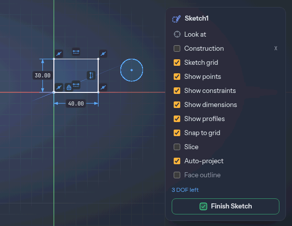

# Sketching and constraints

Most designs start as a flat drawing. You draw it on a plane, tell Extrudo how the parts relate
(this line is horizontal, that circle is 8 mm wide), and the sketch holds its shape when a number
changes. Then you turn the closed regions into solids with [Extrude](./tools/extrude.md) or
[Revolve](./tools/revolve.md).

## Starting a sketch

Choose **Create Sketch** (Solid › Create). The view then waits for a plane: pick an origin plane
or a flat face of a body in the view, or use the **XY**, **XZ** and **YZ** buttons in the panel.
Construction planes you have made are listed there too. If a flat face is already selected when
you choose the tool, the sketch opens on it at once.

A sketch on a face moves with the face when the model changes. A curved face says "A sketch needs
a flat face or a plane".

To come back to a sketch later, double-click it in the browser or on the timeline, or right-click
it and choose **Edit Sketch**.

## Drawing

The Sketch tab's Create group has the tools you use most; the rest are under its ▾ menu. The ones
to know first:

- [Line](./tools/line.md) (`L`)
- [Rectangle](./tools/rectangle.md) (`R`) and its centre and three-point forms
- [Circle](./tools/circle.md) (`C`) and [Arc](./tools/arc.md) (`A`)
- [Polygon](./tools/polygon.md), [Slot](./tools/slot.md) and [Ellipse](./tools/ellipse.md)
- [Fit Point Spline](./tools/spline.md) and [Control Point Spline](./tools/splineControl.md)
- [Text](./tools/text.md) (`Shift+T`), whose letters become profiles like any other shape
- [Import Drawing](./tools/importDrawing.md), for an SVG or DXF file

While a tool runs you can type. Press a digit and the heads-up box beside the pointer takes it:
the length of a line, then `Tab` for its angle; the width of a rectangle, then `Tab` for its
height. Numbers are [expressions](./parameters.md), so `wall * 2` works. A typed length becomes a
dimension, so it stays editable.

**Modify** tools such as [Trim](./tools/trim.md) (`T`), [Offset](./tools/sketchOffset.md) (`O`),
[Sketch Fillet](./tools/sketchFillet.md) (`F`) and [Sketch Move](./tools/sketchMove.md) (`M`)
change what you drew; their constraints and dimensions come along.

## Constraints you didn't ask for

As you draw, the pointer snaps to existing points, midpoints, crossings, curves, and the
horizontal or vertical line through the last point. A snap is also a constraint: end a line on
another line's end and the two points are **coincident**; start on a curve and the point is held
on it; keep a line exactly horizontal and it is **horizontal**. A small glyph near the pointer
shows which snap you are on.

Hold `Ctrl` to draw without snapping. The grid snaps too, and **Snap to grid** in the sketch
palette turns that off.

## Constraint tools

Constraints are the rules that tie shapes together. The Sketch tab's Constraints group has one
button for each:

[Coincident](./tools/coincident.md), [Collinear](./tools/collinear.md),
[Concentric](./tools/concentric.md), [Midpoint](./tools/midpoint.md),
[Fix/Unfix](./tools/fix.md), [Parallel](./tools/parallel.md),
[Perpendicular](./tools/perpendicular.md), [Horizontal](./tools/horizontal.md),
[Vertical](./tools/vertical.md), [Tangent](./tools/tangent.md), [Smooth](./tools/smooth.md),
[Equal](./tools/equal.md) and [Symmetric](./tools/symmetric.md).

Pick a tool, then click the things it ties together. A small glyph appears on the sketch for each
constraint; click one and press `Delete` to remove it. **Show constraints** in the sketch
palette hides the glyphs when they get in the way.

If you ask for something the sketch can't do, the app says so and changes nothing: "Parallel
isn't needed: the sketch already holds it", or "Perpendicular would conflict with the sketch's
other constraints".

## Free, fixed, conflict

The colour of a curve tells you how much it can still move:

| Colour | Meaning |
|---|---|
| Blue | Free: the solver can still move it |
| White in the dark theme, black in the light one | Fixed: nothing can move it |
| Red | Conflict: it is part of an over-constrained set |
| Grey, dashed | Construction geometry |
| Purple | Projected from a body (see below) |

The counter at the bottom of the sketch palette says the same in numbers. A sketch has a number
of **degrees of freedom** (DOF): the independent ways its shapes could still move. "6 DOF left"
means six more constraints or dimensions would pin it down; **Fully constrained ✓** means nothing
can move. You don't have to reach zero. A free sketch is fine to extrude. Fully constrained is a
guarantee that a change to a dimension can't make the shape do something surprising.

You can also drag a free point or curve to see what moves. Press `Esc` during the drag to put it back.

## Dimensions

The [Dimension](./tools/dimension.md) tool (`D`) fixes a size. Click one thing or two: a line
gives its length, two lines their angle (or their distance, if parallel), a circle its diameter,
an arc its radius, two points their distance. Then click where the label should sit. For a length or a distance between points, where you
put the label decides whether it is horizontal (label above or below), vertical (label beside) or aligned.

The new dimension is **driving**: it starts at the current size and from then on it holds the
shape to that value. The value opens for editing as soon as you place it. To change it later,
double-click the label and type a number or an [expression](./parameters.md). The box has a
**Driven** checkbox: tick it and the dimension only shows the measurement, in grey and brackets,
without holding anything.

Every driving dimension is a parameter named `d1`, `d2` and so on, and other fields can use it.
To give one a better name, type `name = value` in its editor, for example `width = 40 mm`. That
makes a [user parameter](./parameters.md) and sets the dimension to it, in one step.

## Over-constraining

A dimension that repeats what the sketch already fixes would over-constrain it. The app stops and
opens a dialog titled **Over-constrained**: the dimension would over-constrain the sketch, and
would you like to add it as a driven one? Choose **Add as driven** to keep it as a measurement,
or cancel to drop it. A conflict that gets in some other way turns the geometry
red, and the counter says "Over-constrained: the red geometry has a constraint too many". Undo,
or delete one of the constraints involved.

## Construction geometry

Press `X` (or tick **Construction** in the palette) and what you draw next is construction
geometry: grey, dashed and never a profile. It is for lines you only want to measure from or
constrain to, such as a centreline or a circle that sets where bolt holes go. Press `X` again to
go back. To change a curve you already drew, select it and use the **Construction** checkbox in
the selection panel.

## Project and Intersect

[Project](./tools/project.md) (`P`) copies edges, faces, vertices or a whole body into the sketch.
Pick them in the view, or pick a body by its row in the browser. The projected curves are fixed,
you can constrain and dimension against them, and they follow the model: change the part
underneath and the sketch is updated, along with what is constrained to it.
[Intersect](./tools/intersect.md) (`Shift+P`) brings in the curves where a face or body cuts
through the sketch plane. With **Keep linked** off, the curves come in as ordinary entities that
no longer follow the model.

**Auto-project** does that as you draw. With it on, a line's end that snaps to a body's edge or
corner projects that edge and ties the point to it. It is on by default, and a checkbox in the
sketch palette and in **Settings** turns it off. **Auto-project face outline** also projects a
flat face's outline when a sketch opens on it.

## Profiles

A closed loop of curves is a **profile**: the sketch shades it so you can see what an extrude
would pick. A circle inside a larger outline is a hole in that outline and a region in its own
right. **Show profiles** in the palette turns the shading off. Select a profile in the view and
the selection panel shows its area. Curves that don't close, and construction geometry, make no
profile.

## Finish Sketch

**Finish Sketch** (the green button in the palette) closes the sketch. Everything you did in it
is one undo step, so `Ctrl+Z` takes the whole session back. Extrude, Revolve and the other
features read the profiles from the finished sketch; once a feature uses one, the sketch hides
itself so it doesn't sit in front of the new faces. The browser's eye shows it again.
