# A threaded bottle cap

You will make a 32 mm bottle cap with a thread inside, and an adapter with two
threads that screws into it. Then you will change two numbers and watch every
thread refit. It takes about 30 minutes, and it is the most advanced tutorial
here: do [Your first part](./first-part.md) first if sketching and dimensions
are new to you.

Both parts are *revolved*: you sketch half of a cross-section and spin it round
an axis. **Threads take a few seconds to compute**, so expect a short wait on
the thread steps and when you change the parameters at the end.

Open the app at [{{APP_URL}}]({{APP_URL}}/).

<!-- step: parameters -->
### 1. Start a design and add your numbers

On the home screen press **New design**. Press the name at the top, type
`Bottle cap` and press `Enter`. Open the **Home** tab, press **Parameters** and
add five parameters, each with the unit **Length**:

| Name | Expression |
|---|---|
| `capDia` | `32 mm` |
| `capHeight` | `14 mm` |
| `wall` | `2 mm` |
| `adapterLow` | `20 mm` |
| `stepHeight` | `10 mm` |

Under each row you see its value, such as `= 10.00 mm`. Press `Esc` to close
the dialog.

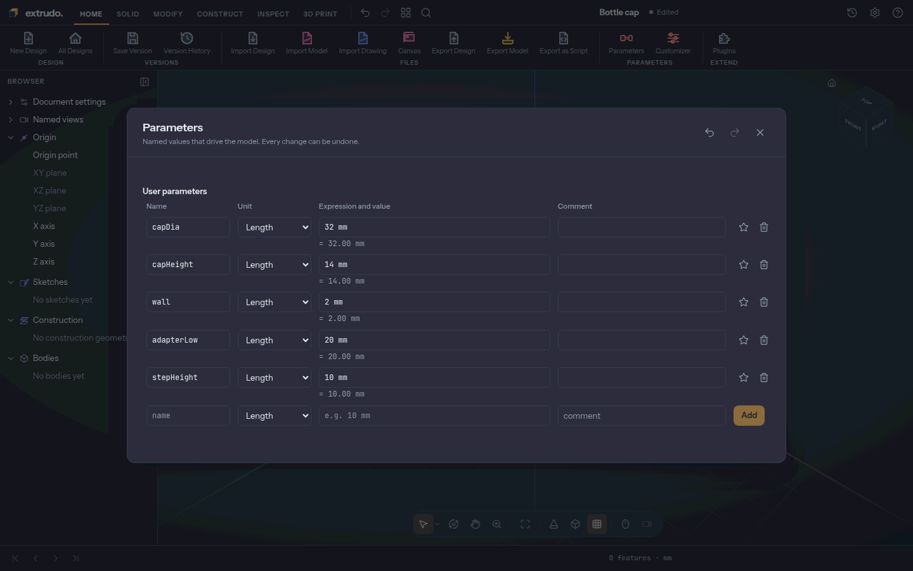

<!-- step: cap-sketch -->
### 2. Sketch the cap's cross-section

Open the **Solid** tab, press **Create Sketch** and choose the **XZ** plane, the
wall you face from the front. In the **Sketch palette** switch **Show
constraints** off. Press **Rectangle** (or `R`), click the origin and then click
20 mm across and 20 mm up. Press `Esc`.

This rectangle is half of the cap seen from the side: its left edge lies on the
vertical Z axis, which will be the cap's centre line. The palette says **2 DOF
left**.

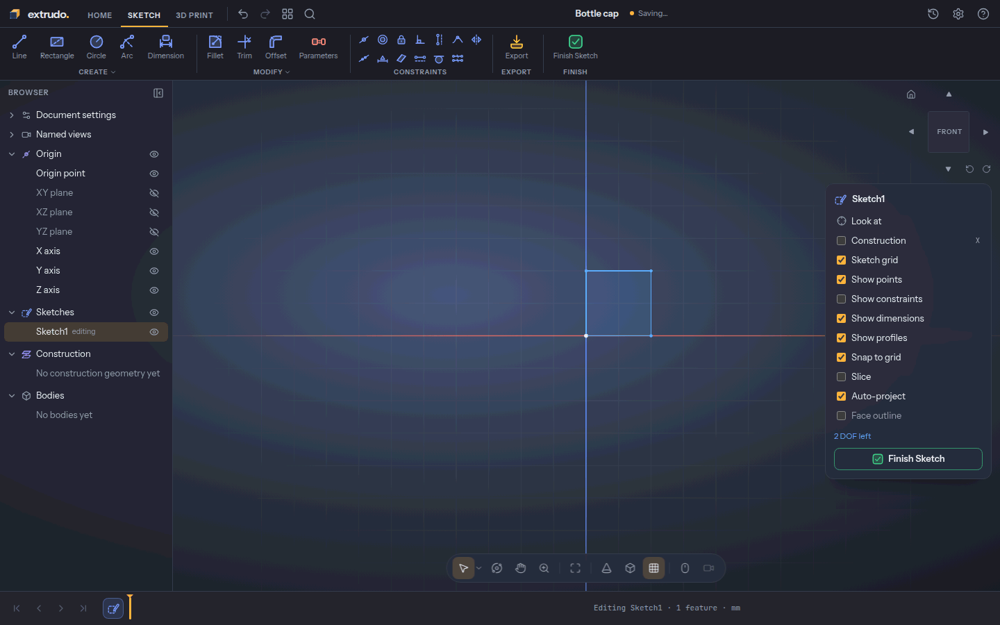

<!-- step: cap-dimensions -->
### 3. Dimension it with your parameters

Press **Dimension** (or `D`). Click the rectangle's top edge, click above it to
place the label, type `capDia / 2` and press `Enter`. The width is a radius, so
it is half the diameter. Then click the right edge, click to its right, type
`capHeight` and press `Enter`. Press `Esc`.

The rectangle becomes 16 mm wide and 14 mm tall, and the palette reads **Fully
constrained ✓**.

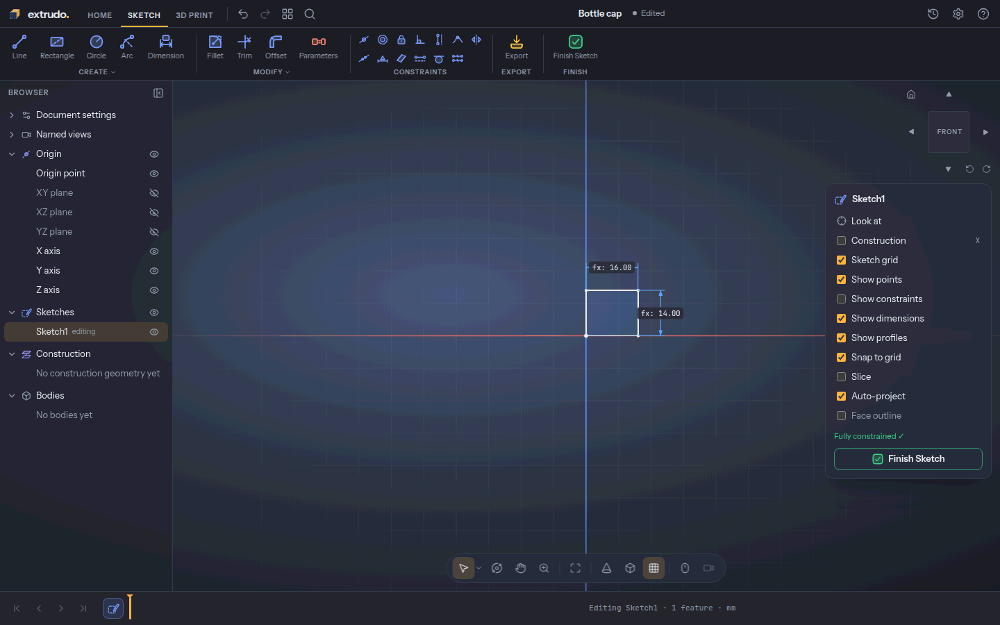

<!-- step: revolve -->
### 4. Revolve it into a cylinder

Press **Finish Sketch**. Click inside the rectangle to select its shape, then
open **Solid** › **Revolve**. For **Axis** click the vertical **Z axis** above the
shape; the field reads **Z axis**. The preview is a whole turn: a solid cylinder,
Ø32 mm and 14 mm tall.

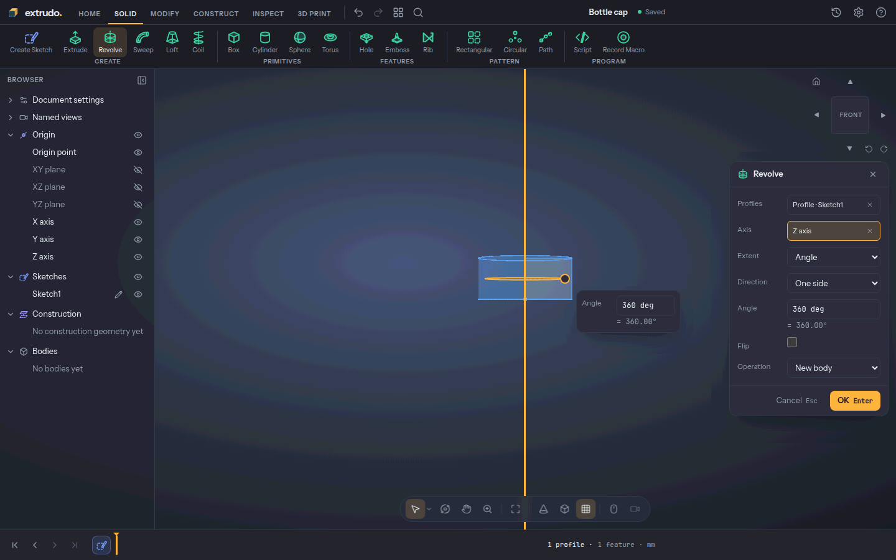

<!-- step: cap-body -->
### 5. Press OK and name the body

Press **OK**. The new body appears under **Bodies** in the browser. Press `F2`
on it, type `Cap` and press `Enter`. Press `Shift+1` to look at it from the
front corner. It has three faces: top, bottom and the side.

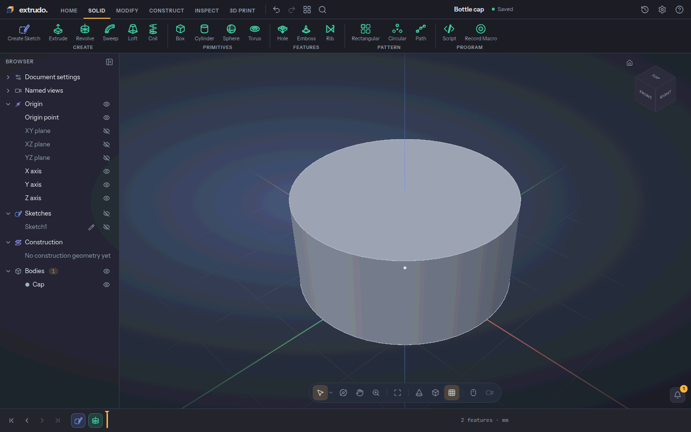

<!-- step: shell -->
### 6. Hollow it out from below

You need to see the bottom: press `Shift+3` for the bottom view and click the
cap's bottom face. Open the **Modify** tab and press **Shell**. Type `wall` in
**Thickness** and press **OK**.

The cap is now a cup, open below and 2 mm thick all round. It has five faces:
outside, top, inside wall, inside top and the rim.

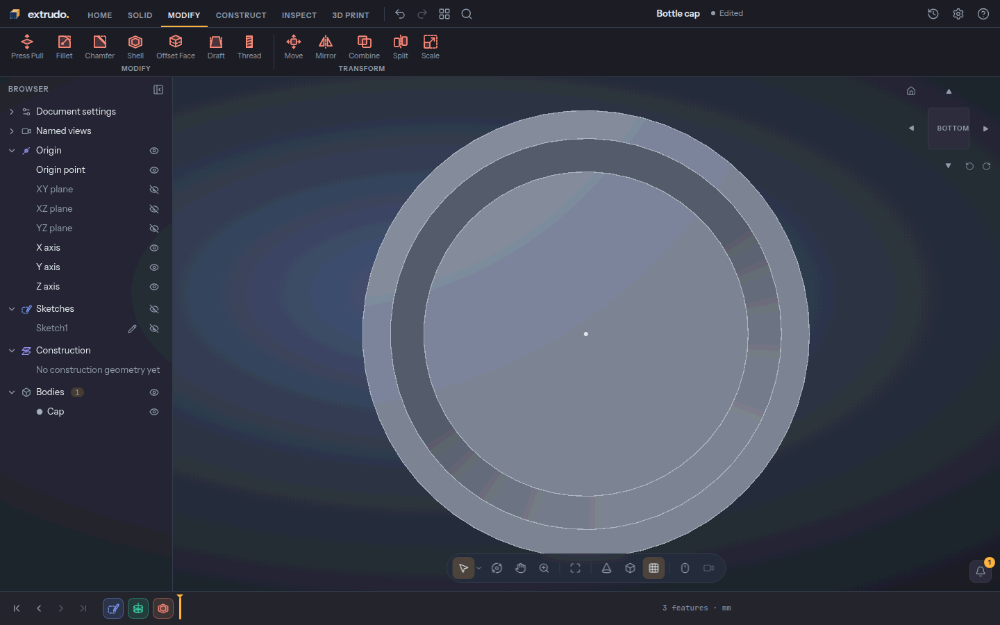

<!-- step: cap-thread -->
### 7. Cut a thread inside the cap

Stay in the bottom view. Click the cup's **inside wall**, close to the edge: a
click in the middle of the hollow picks the flat top instead. Press **Thread** in
the **Modify** tab. **Faces** reads **1 face** and **Size** reads **auto**: Extrudo
fits the standard metric thread to the wall's diameter, here M30 in a Ø28 wall.

Wait a few seconds for the preview, then press **OK**. The inside of the cap
gets a spiral groove, and its outside is unchanged at 32 × 32 × 14 mm.

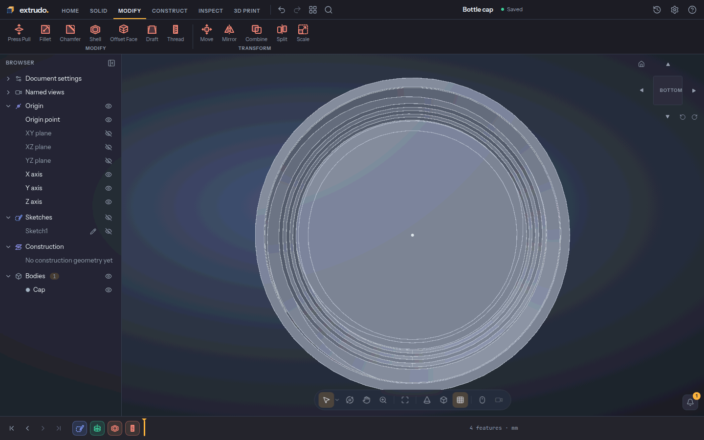

<!-- step: adapter-sketch -->
### 8. Sketch the adapter below the cap

Open the **Solid** tab, press **Create Sketch** and choose **XZ** again. The
adapter reaches 30 mm below the cap, so scroll out until z = −30 mm is on screen,
and switch **Show constraints** off.

Press **Point** and click the origin: that pins the sketch's top. Press **Line**
(or `L`) and click these points in turn: (0, −30), (10, −30), (10, −20),
(20, −20), (20, −10), (0, −10) and back to (0, −30). Press `Esc` twice.

You drew a stepped half-section: a narrow bottom and a wider collar above it.
The palette says **5 DOF left**.

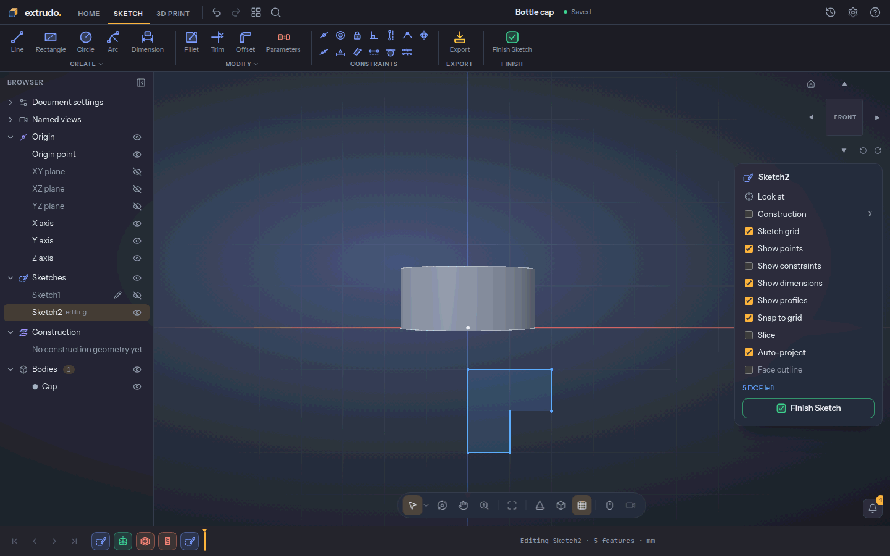

<!-- step: adapter-dimensions -->
### 9. Dimension the adapter

Press **Dimension** (or `D`) and add five dimensions. Each one is: pick, place the
label, type, `Enter`.

1. The origin and the bottom-right corner (10, −30), label to the right: `3 * stepHeight`.
2. The same two points, label above: `adapterLow / 2`.
3. The first step's vertical side, label to the right: `stepHeight`.
4. The second step's vertical side, label to the right: `stepHeight`.
5. The top edge, label above: `capDia / 2 - wall`. That is the same width as the
   cap's inside, so the adapter will meet it.

Press `Esc`. The palette reads **Fully constrained ✓**. A sixth dimension would
over-constrain it.

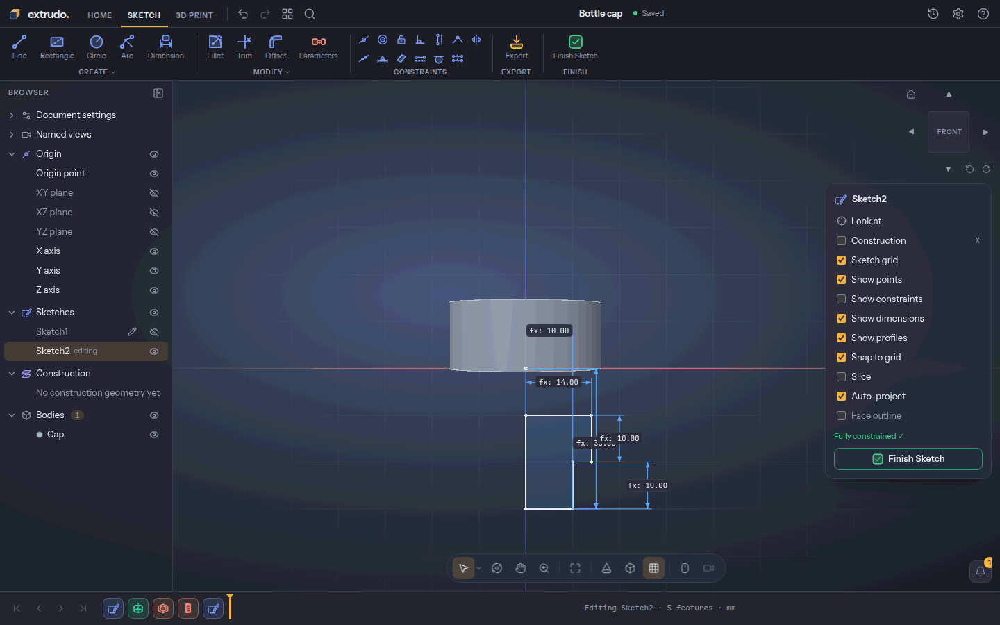

<!-- step: adapter-revolve -->
### 10. Revolve the adapter as a second body

Press **Finish Sketch**. Click inside the lower step to select its shape and open
**Revolve**. Set **Operation** to **New body** so it does not join the cap. Click
the **Z axis** below the shape, press **OK**, and rename the new body `Adapter`.

Under **Bodies** you now have `Cap` and `Adapter`. The adapter is Ø28 mm and 20 mm
tall with five faces.

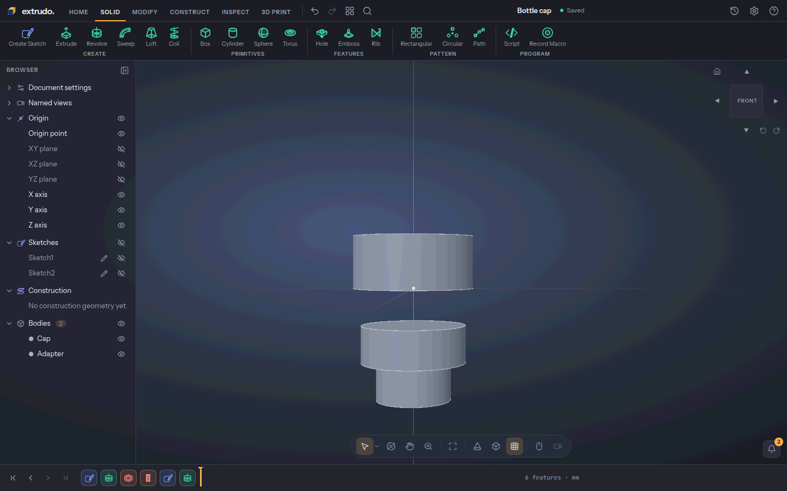

<!-- step: adapter-threads -->
### 11. Thread both steps of the adapter

Press `Shift+4` for the front view. Click the narrow step, open **Modify** ›
**Thread**, then click the wide step as well: **Faces** reads **2 faces**. Leave
**Size** on **auto** and wait for the preview. Press **OK**.

Each step gets the thread that fits it, M20 on the narrow one and M24 on the
wide one. A thread turns the step down to its crests, so the adapter ends up
Ø23.8 mm; the cap is unchanged.

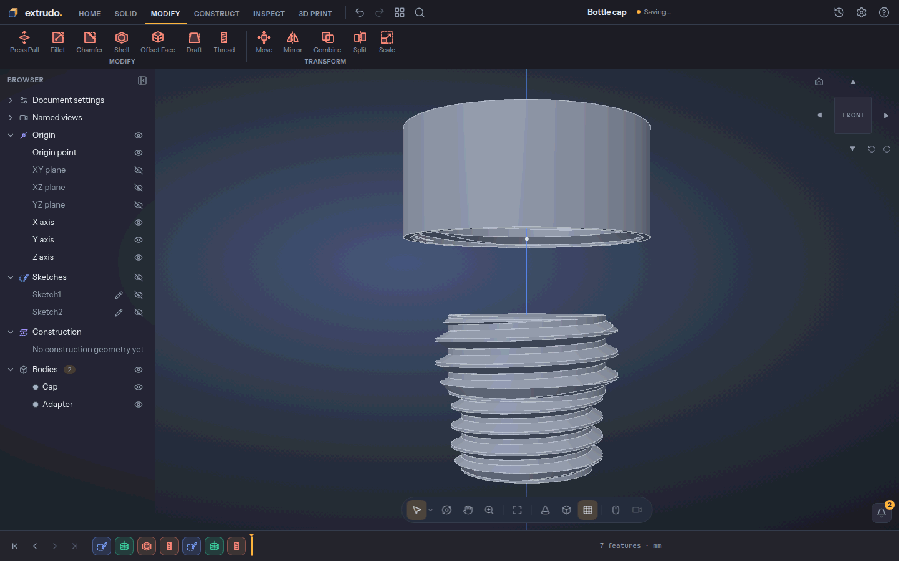

<!-- step: change-parameters -->
### 12. Change two numbers

Open the **Home** tab, press **Parameters** and set `capDia` to `40 mm` and
`adapterLow` to `24 mm`. Press `Esc` and wait while the threads are rebuilt.

Both sketches follow the parameters and every thread refits: the cap is now
40 mm across, and the adapter 35.8 mm. The bigger cap bore takes an M39 thread and
the wider adapter collar an M36, so the two parts still mesh. If you do not like
it, `Ctrl+Z` undoes the change.

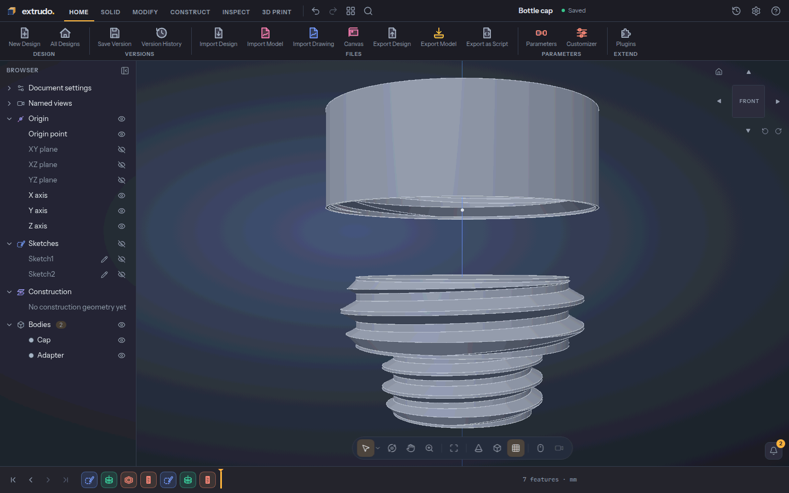

## What you learned

- **Revolve** spins a sketched half-section about an axis, which suits caps,
  knobs and anything round. A second **Revolve** with **New body** makes a part of
  its own.
- **Shell** hollows a body and opens the face you pick.
- **Thread** with **Size** on **auto** fits a standard thread to any round wall,
  inside or out, and refits when the wall changes.
- Parameters reach through sketches, solids and threads, so one edit resizes the
  whole design.

Related tools: [Rectangle](../tools/rectangle.md), [Line](../tools/line.md),
[Dimension](../tools/dimension.md), [Revolve](../tools/revolve.md),
[Shell](../tools/shell.md), [Thread](../tools/thread.md) and
[Parameters](../tools/parameters.md). The guide pages [Sketching](../sketching.md),
[Features and the timeline](../features-and-timeline.md) and
[Parameters](../parameters.md) go deeper.
