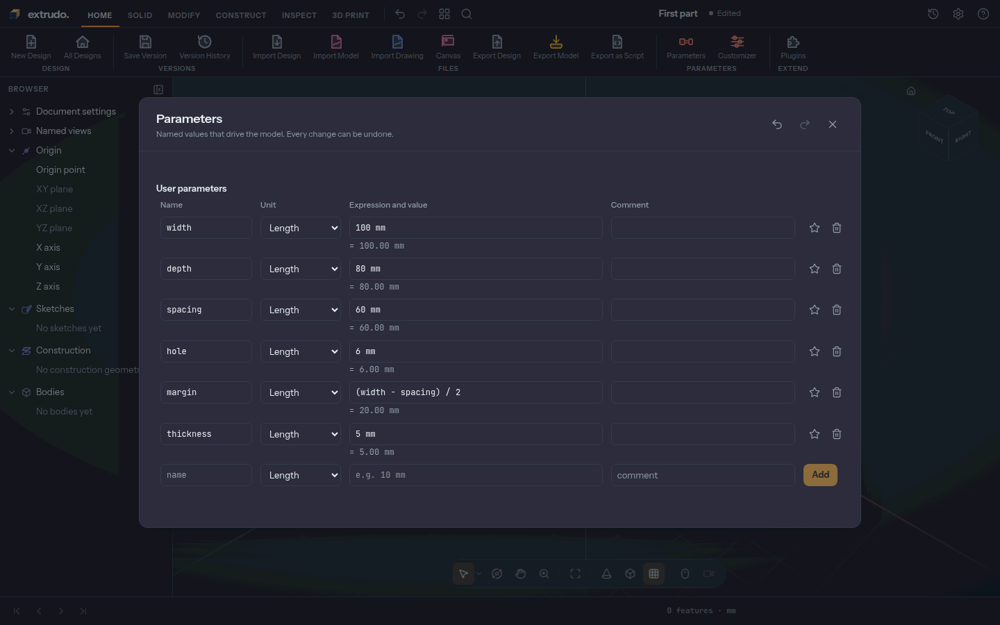
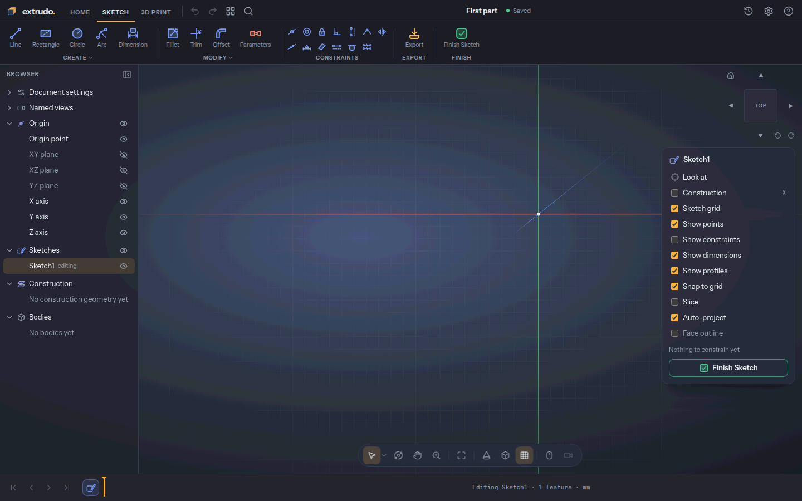
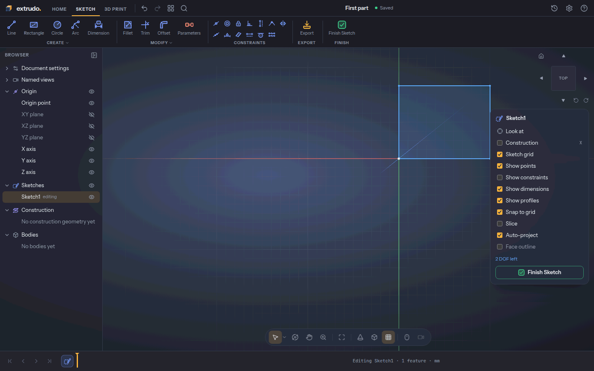
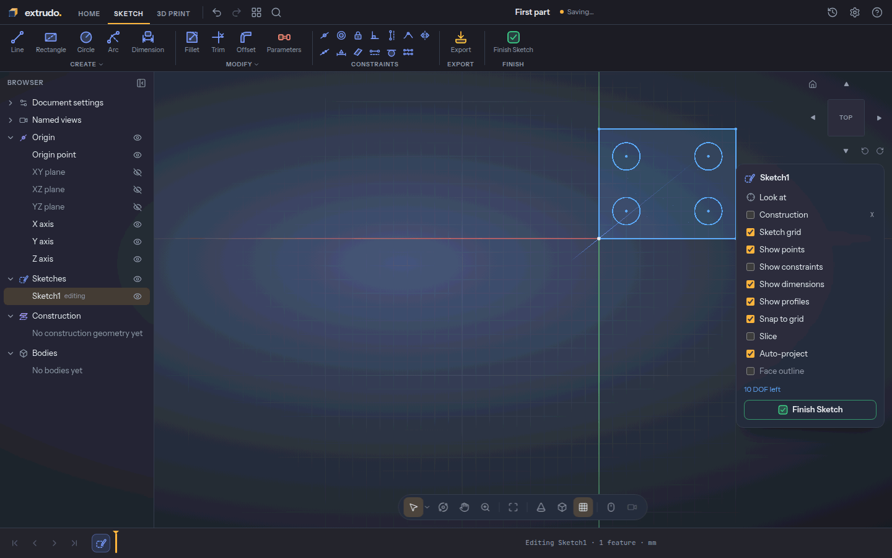
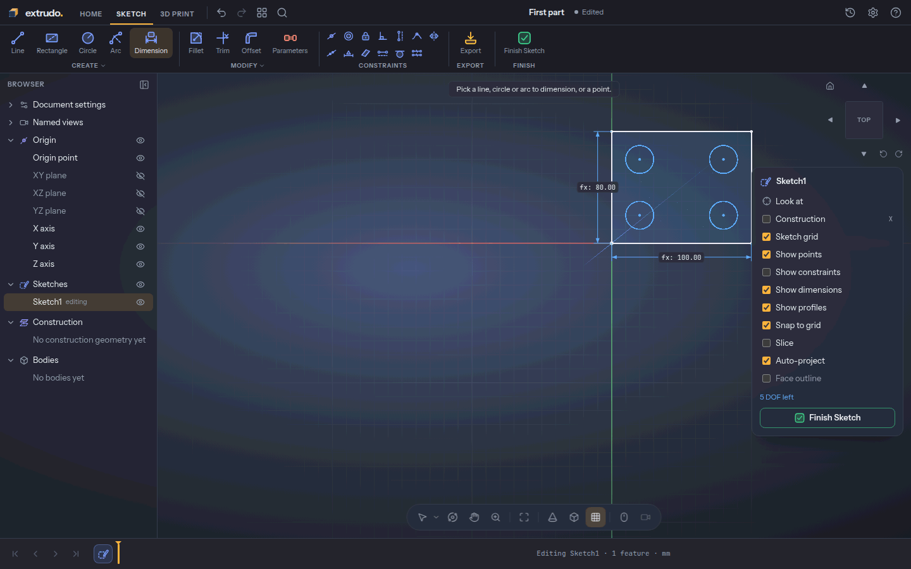
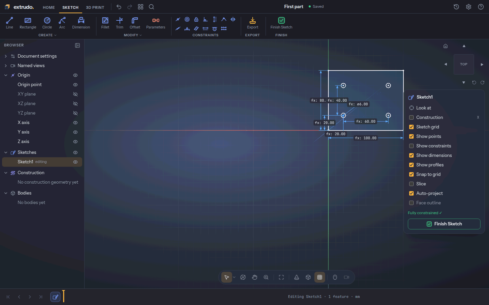
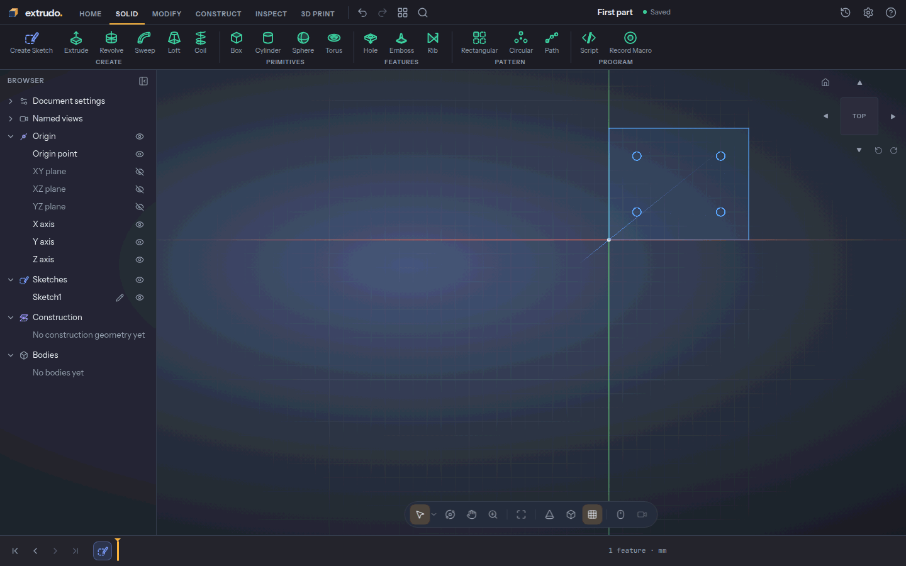
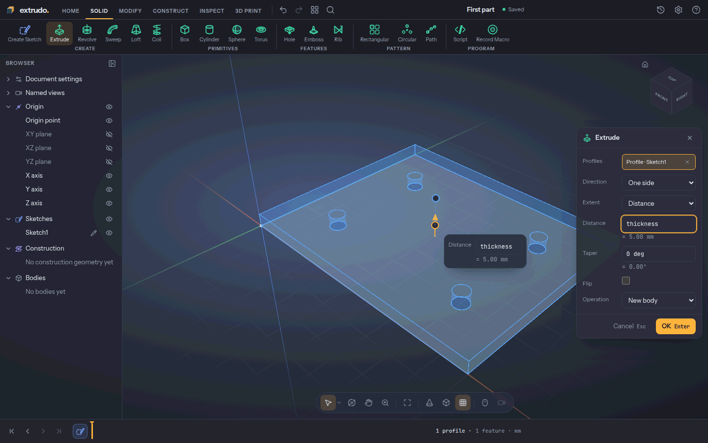
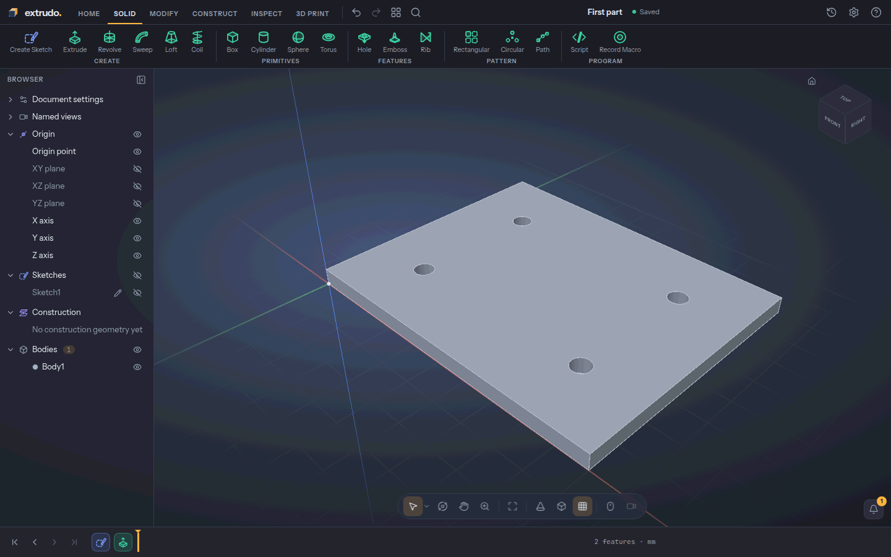
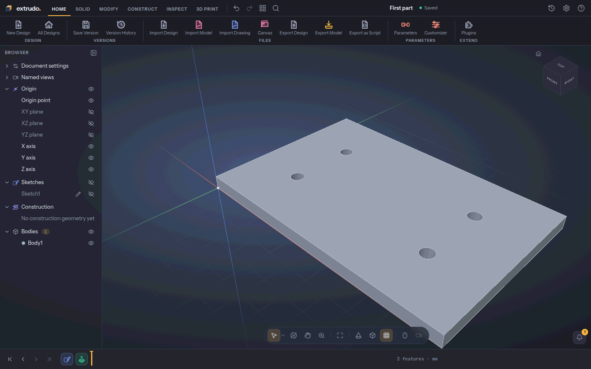

# Your first part: a plate with four holes

You will make a 100 × 80 mm plate with a hole in each corner area, 5 mm thick,
and change it afterwards by editing a number. You need no CAD experience. It
takes about 15 minutes.

The idea behind Extrudo is that you **name your numbers**. The plate's width,
depth and thickness are *parameters*. You draw once, tell the drawing which
parameters it follows, and then change the parameters whenever you like.

Open the app at [{{APP_URL}}]({{APP_URL}}/).

<!-- step: parameters -->
### 1. Start a design and add your numbers

On the home screen press **New design**. Press the name at the top, type
`First part` and press `Enter`. Then open the **Home** tab and press
**Parameters**.

In the row at the bottom type a **name**, leave the unit on **Length**, type an
expression and press **Add**. Add these six:

| Name | Expression |
|---|---|
| `width` | `100 mm` |
| `depth` | `80 mm` |
| `spacing` | `60 mm` |
| `hole` | `6 mm` |
| `margin` | `(width - spacing) / 2` |
| `thickness` | `5 mm` |

`margin` is worked out from the others: under its row you see `= 20.00 mm`. It
is the space between the plate's edge and the first hole, so the holes stay
centred whatever the width. Press `Esc` to close the dialog.

<!-- step: create-sketch -->
### 2. Start a sketch on the floor

A solid starts as a flat drawing, a *sketch*. Open the **Solid** tab, press
**Create Sketch** and choose the **XY** plane, the floor of the model. The view
turns to look straight down on it.

Scroll to zoom out a little so the whole plate will fit. In the **Sketch
palette** on the right, switch **Show constraints** off: the little symbols are
useful later, but they would crowd this tutorial.

<!-- step: rectangle -->
### 3. Draw the plate

Press **Rectangle** (or `R`). Click the origin, where the green and red lines
cross, then click the opposite corner at 100 mm across and 80 mm up. The grid
snaps your clicks to 10 mm steps, so this is easy to hit. Press `Esc` to finish
the rectangle.

The corner you started on is pinned to the origin. The palette says how many
**DOF** (degrees of freedom) are left: how many ways the drawing can still move.

<!-- step: holes -->
### 4. Draw four holes

Press **Circle** (or `C`). For each hole, click its centre, then click 10 mm to
the side to set the radius. The centres are at (20, 20), (80, 20), (20, 60) and
(80, 60) mm. Press `Esc` when all four are in.

Extrudo noticed that the centres line up in rows and columns and added those
constraints for you. The palette now counts **10 DOF left**.

<!-- step: equal-holes -->
### 5. Make the holes the same size

In the **Constraints** group press **Equal**. Click the first circle, then
another circle; repeat for the other two. A constraint is a rule the drawing
keeps, here "these circles have the same radius". The palette says
**7 DOF left**. Press `Esc` to leave the tool.

<!-- step: dimension-plate -->
### 6. Dimension the plate with your parameters

Press **Dimension** (or `D`). Click the plate's bottom edge, then click below it
to place the label. An editor opens: type `width` and press `Enter`. Now click
the left edge, click to its left, type `depth` and press `Enter`.

You did not type 100 or 80. The label shows the parameter's value, so the
sketch will follow it when it changes.

<!-- step: dimension-holes -->
### 7. Dimension the holes

Keep the Dimension tool going and add five more, the same way (pick, place the
label, type, `Enter`):

1. The two bottom hole centres, label below: `spacing`.
2. The two left hole centres, label to the left: `depth - 2 * margin`. This
   centres the holes top to bottom.
3. The origin and the bottom-left centre, label below: `margin`.
4. The same two points, label to the left: `margin`.
5. The bottom-left circle's edge, label outside: `hole`.

Press `Esc`. The palette reads **Fully constrained ✓**: every part of the drawing
is pinned by a number, so nothing is left to chance.

<!-- step: finish-sketch -->
### 8. Finish the sketch

Press **Finish Sketch**. Your sketch appears in the **timeline** at the bottom as
`Sketch1`. The timeline is the list of steps that made your part, in order.

<!-- step: extrude -->
### 9. Give the plate thickness

Click the plate between the holes to select its shape, and press `E` (**Extrude**).
Type `thickness` in **Distance**. The preview shows a plate with four holes
through it. The default **Operation** is **New body**, which is what you want.

<!-- step: result -->
### 10. Press OK

Press **OK**. You now have a solid, `Body1`, and `Extrude1` joins the timeline.
It is 100 × 80 × 5 mm with 10 faces: top, bottom, four sides and four hole walls.

<!-- step: change-parameters -->
### 11. Change a number and watch the part follow

Open the **Home** tab, press **Parameters** again and change `width` to
`120 mm`, `spacing` to `70 mm` and `thickness` to `6 mm`. Press `Esc`.

The plate is now 120 mm wide and 6 mm thick, and the holes have moved with it,
because the sketch and the extrude follow their parameters. If you do not like
it, `Ctrl+Z` undoes the change.

<!-- step: export-stl -->
### 12. Export for printing

Open the **3D Print** tab and press **Export**. Choose **STL**. The summary says
the model is *watertight*, which means a slicer can read it without repair. Press
**Export STL** and the file downloads.

## What you learned

- Named **parameters** drive dimensions and features, so changing one number
  changes the part.
- A **sketch** is a drawing kept in shape by **constraints** and **dimensions**;
  **Fully constrained** means nothing is left to chance.
- **Extrude** turns a sketch shape into a solid, and the **timeline** records
  every step so you can come back and edit.
- **Export** writes a file your slicer can print.

Related tools: [Rectangle](../tools/rectangle.md), [Circle](../tools/circle.md),
[Equal](../tools/equal.md), [Dimension](../tools/dimension.md),
[Parameters](../tools/parameters.md) and [Extrude](../tools/extrude.md).
