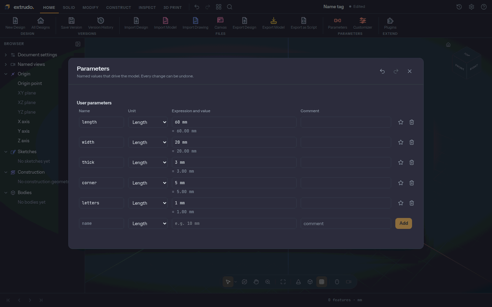
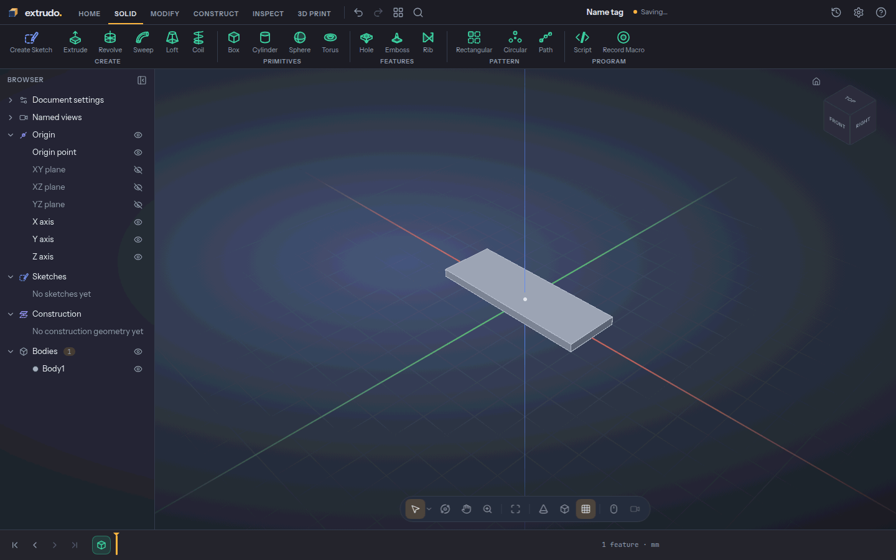
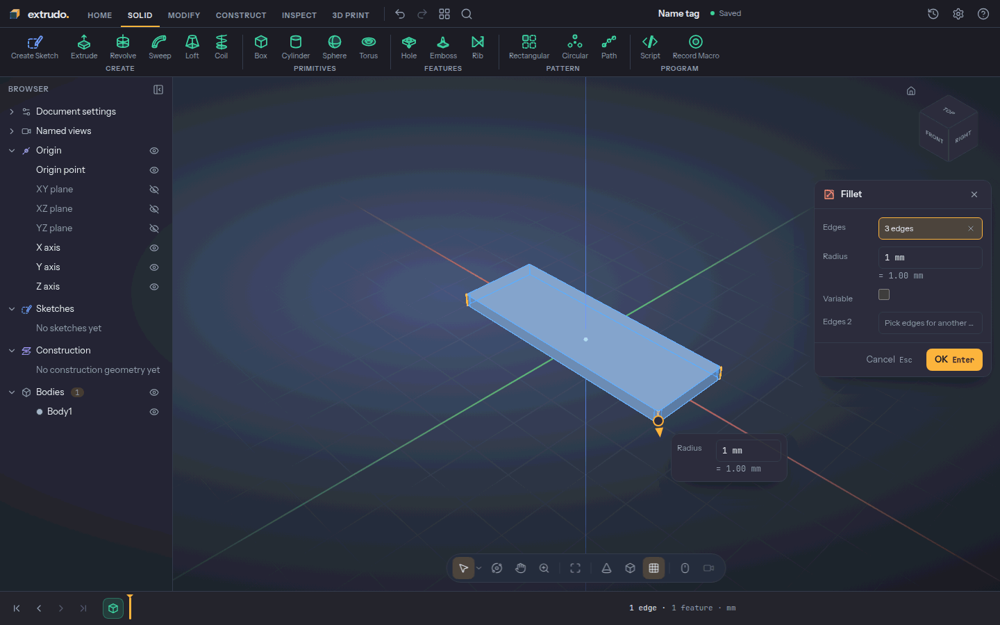
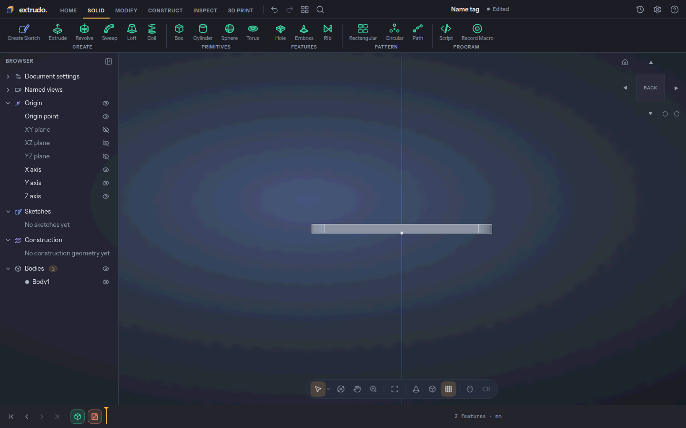
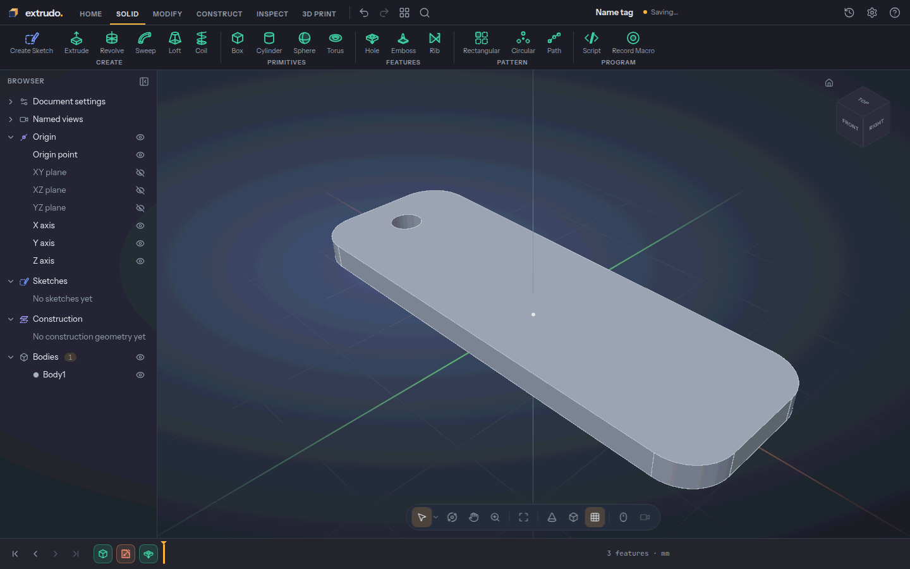
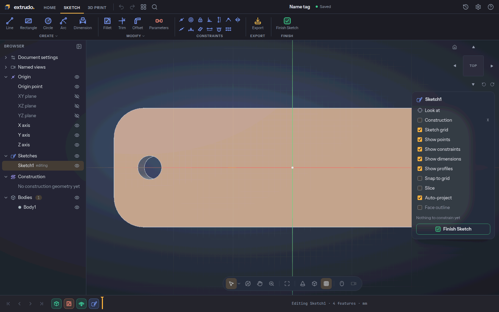
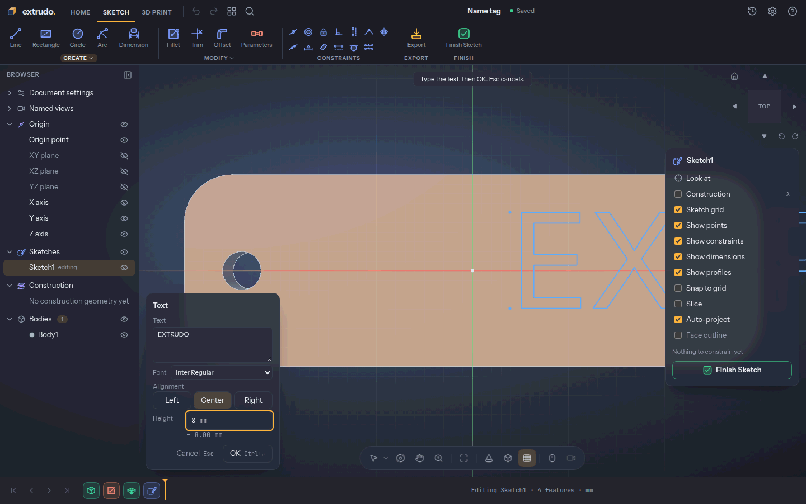
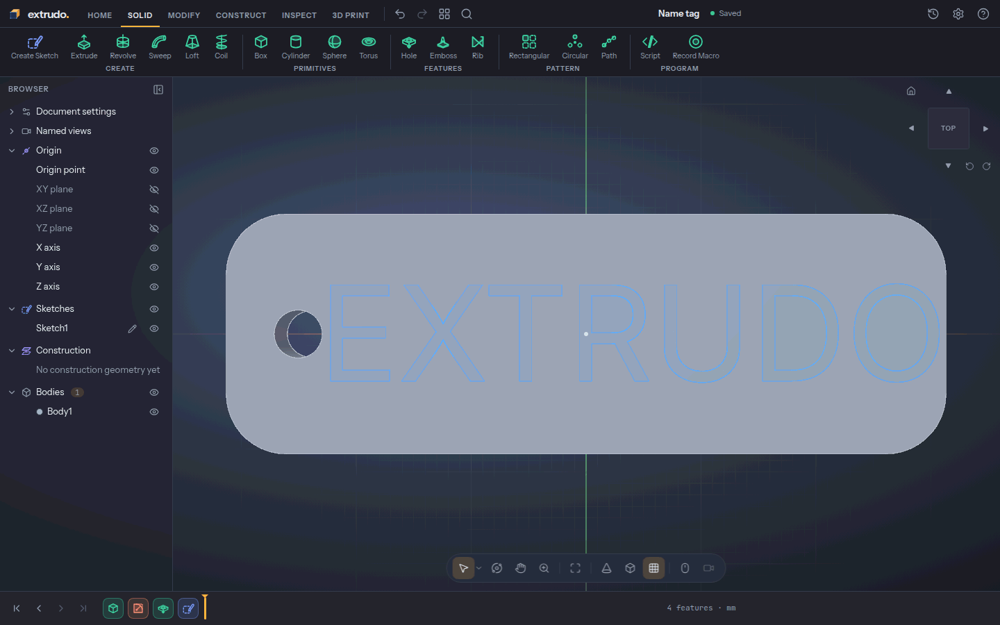
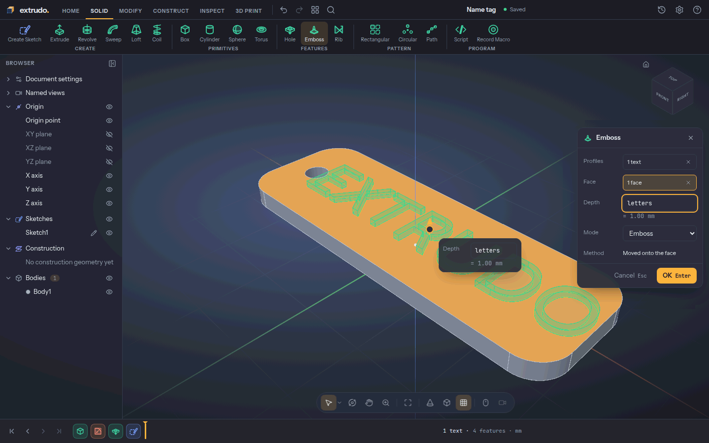
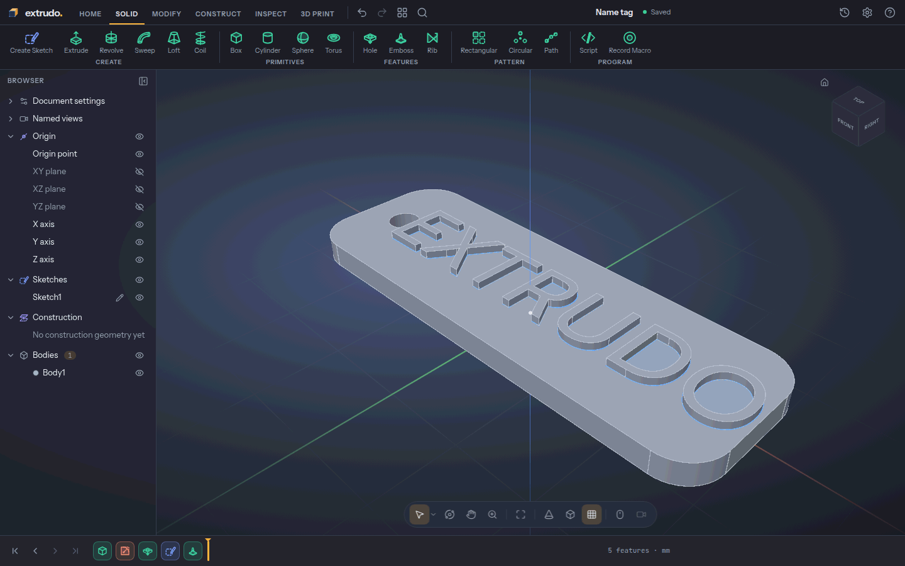

# A name tag

You will make a keyring name tag: a small plate with rounded corners, a hole for
the ring and your name raised off the top. You need no CAD experience, and it
takes about 20 minutes.

The letters are a **sketch text**, drawn on the plate's top face, and **Emboss**
lifts them out of the face so they stand as part of the same solid. Everything
is driven by named numbers, so you change the name's length later by editing one
value.

Open the app at [{{APP_URL}}]({{APP_URL}}/).

<!-- step: parameters -->
### 1. Start a design and add your numbers

On the home screen press **New design**. Press the name at the top, type
`Name tag` and press `Enter`. Then open the **Home** tab and press
**Parameters**.

In the row at the bottom type a **name**, leave the unit on **Length**, type an
expression and press **Add**. Add these five:

| Name | Expression |
|---|---|
| `length` | `60 mm` |
| `width` | `20 mm` |
| `thick` | `3 mm` |
| `corner` | `5 mm` |
| `letters` | `1 mm` |

The plate is `length` × `width` and `thick` tall, the corners are rounded by
`corner`, and the letters stand `letters` proud of the top. Press `Esc` to close
the dialog.

<!-- step: box -->
### 2. Draw the plate with the Box tool

Open the **Solid** tab and press **Box**. Leave **Plane** on **XY**, the floor of
the model. Set **Length** to `length`, **Width** to `width` and **Height** to
`thick`. Press **OK**.

You now have a solid plate, `Body1`, 60 × 20 × 3 mm with six faces.

<!-- step: fillet-three -->
### 3. Round three corners

Press `Shift+1` for the home view. Press `F` (**Fillet**). Hover the plate's
near vertical corner edge until it lights up and click it; the **Fillet** dialog
opens with **1 edge**.

Scroll to zoom out a little so the corners clear the dialog, then click the
other two vertical corner edges you can see. The dialog now says **3 edges**.

<!-- step: fillet-back -->
### 4. Bring in the hidden corner

One corner faces away from you in the home view. Press `Shift+5` to look from
the back, zoom out and click that last vertical edge. The dialog reads
**4 edges**.

Type `corner` in **Radius** and press **OK**. All four corners are now rounded,
and the top and bottom faces are whole again.

<!-- step: hole -->
### 5. Drill the key-ring hole

Press `Shift+1`. Press `H` (**Hole**). The dialog opens on the **XY** plane.
Click the plate's top face near its left end: the click picks the face and places
the hole where it landed.

Set **X** to `-length / 2 + 6 mm`, **Y** to `0 mm`, **Diameter** to `4 mm` and
**Extent** to **Through**, then press **OK**. The hole is 6 mm in from the left
end, ready for a keyring.

<!-- step: sketch-face -->
### 6. Sketch on the top face

Press **Create Sketch** and click the top face in the middle of the right half.
The view turns to look straight down on it, and a new sketch starts on the face.

In the **Sketch palette** on the right, switch **Snap to grid** off: the letters
go exactly where you put them, not on the grid. Turn **Show profiles** on so a
click inside a letter takes the whole text later.

<!-- step: text -->
### 7. Type the name

Press `Shift+T` (**Text**), then click where the first line's baseline starts, a
little left of centre at x = 4 mm. The **Text** panel opens.

Type `EXTRUDO`, press **Center**, and set **Height** to `8 mm`. The letters
appear on the plate. An 8 mm cap height makes `EXTRUDO` about 51 mm wide; centred
on x = 4 mm it sits between the hole and the far end.

<!-- step: finish-sketch -->
### 8. Finish the sketch

Press **OK** in the Text panel, then `Esc` to leave the tool. Press **Finish
Sketch**. The sketch joins the **timeline** at the bottom as `Sketch1`.

<!-- step: emboss -->
### 9. Raise the letters

Press `Shift+1`. Click a letter in the model: the whole text is selected at once.
Run **Emboss** in the **Solid** tab's Features group.

The **Profiles** field reads **1 text**. Click the top face clear of the letters
and the hole so **Face** reads **1 face**. Set **Depth** to `letters` and press
**OK**. The letters rise off the plate.

<!-- step: result -->
### 10. The name tag

The plate is still one body, `Body1`. The letters stand on it rather than
floating beside it, so it prints as a single piece. It is 60 × 20 mm and 4 mm
tall: 3 mm of plate plus 1 mm of letters.

<!-- step: export-3mf -->
### 11. Export for printing

Open the **3D Print** tab and press **Export**. Choose **3MF**. The summary says
the model is *watertight*, which means a slicer can read it without repair. Press
**Export 3MF** and the file downloads.

## What you learned

- **Sketch text** gives you real letters as sketch geometry you can shape and
  place.
- **Emboss** raises a sketch's profiles or text out of a face, so the letters
  become part of the same solid as the plate.
- A **fillet** rounds edges; on a thin plate one corner can hide from a view, and
  turning the view brings it back.
- A **hole** through the plate leaves room for a keyring.
- **3MF** is a print-ready export your slicer reads.

Related tools: [Text](../tools/text.md), [Emboss](../tools/emboss.md),
[Fillet](../tools/fillet.md), [Hole](../tools/hole.md), [Box](../tools/box.md),
[Parameters](../tools/parameters.md) and [Export](../tools/export.md). New to
Extrudo? Start with [Your first part](./first-part.md), or read the
[guide](../index.md).
