# A storage box

You will make an 80 × 60 × 40 mm storage box with 3 mm walls and a 4 mm floor,
then change its numbers so it follows. It builds on
[Your first part](./first-part.md), so sketch a plate first if you have not. It
takes about 20 minutes.

This one shows the other half of Extrudo's idea. You sketch once on the floor,
give the sketch height, and then **sketch on the top of the solid** to hollow it
out. The walls are a parameter, so making the box wider moves the walls with it.

Open the app at [{{APP_URL}}]({{APP_URL}}/).

<!-- step: parameters -->
### 1. Start a design and add your numbers

On the home screen press **New design**. Press the name at the top, type
`Storage box` and press `Enter`. Open the **Home** tab and press **Parameters**.

Add these five, the same way as before (a name, the unit on **Length**, an
expression, **Add**):

| Name | Expression |
|---|---|
| `width` | `80 mm` |
| `depth` | `60 mm` |
| `height` | `40 mm` |
| `wall` | `3 mm` |
| `bottom` | `4 mm` |

Press `Esc` to close the dialog.

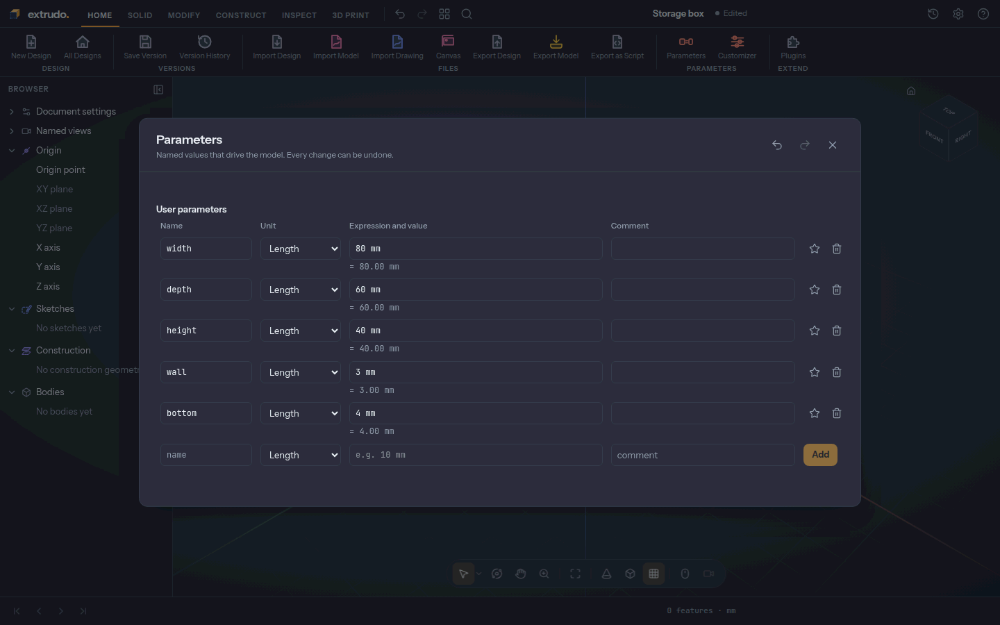

<!-- step: create-sketch -->
### 2. Start a sketch on the floor

Open the **Solid** tab, press **Create Sketch** and choose the **XY** plane, the
floor of the model. The view turns to look straight down on it.

Scroll to zoom out a little so the whole box will fit. In the **Sketch palette**
on the right, switch **Show constraints** off: the little symbols would crowd
this tutorial.

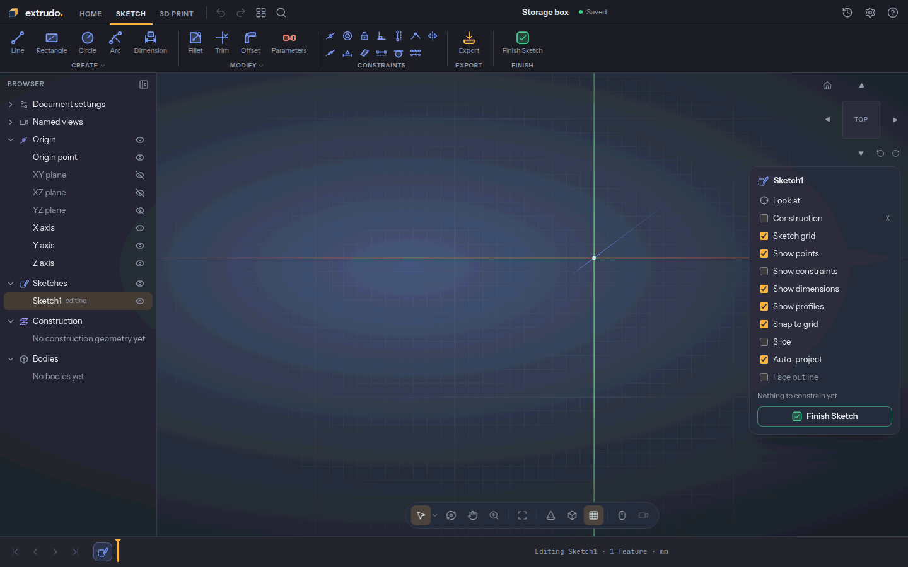

<!-- step: rectangle -->
### 3. Draw the base

Press **Rectangle** (or `R`). Click the origin, where the green and red lines
cross, then click the opposite corner at 80 mm across and 60 mm up. Press `Esc`
to finish the rectangle.

The corner you started on is pinned to the origin, and the grid snaps your
clicks to 10 mm steps.

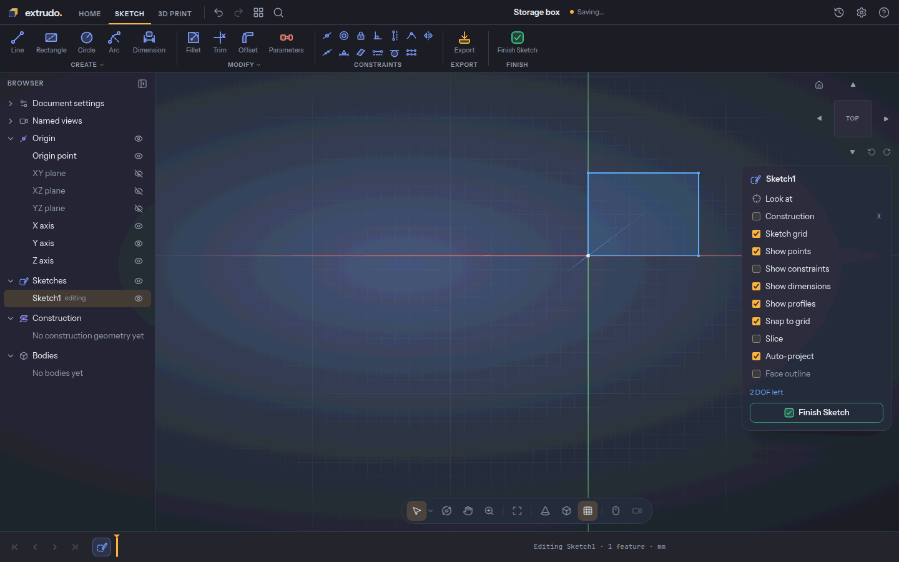

<!-- step: dimension -->
### 4. Size the base with your parameters

Press **Dimension** (or `D`). Click the bottom edge, click below it to place the
label, type `width` and press `Enter`. Then click the left edge, click to its
left, type `depth` and press `Enter`. Press `Esc` to leave the tool.

The palette reads **Fully constrained ✓**: the two dimensions pin the whole
rectangle, so the box will follow `width` and `depth` when you change them.

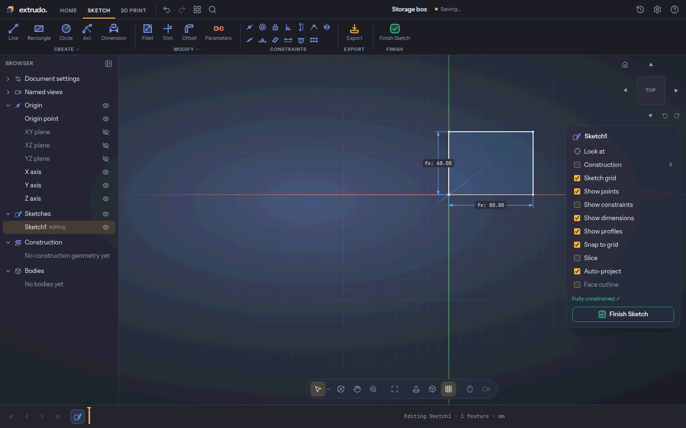

<!-- step: extrude-base -->
### 5. Give the base its height

Press **Finish Sketch**. Click the plate's inside to select its shape and press
`E` (**Extrude**). Type `height` in **Distance**. The preview shows a solid
80 × 60 × 40 mm block; the default **Operation** is **New body**, which is what
you want.

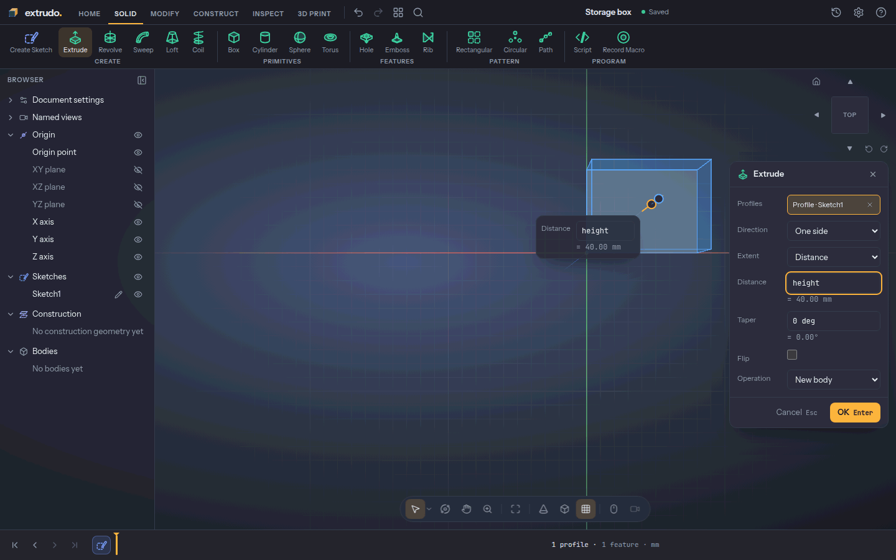

<!-- step: result -->
### 6. Press OK

Press **OK**. You now have a solid, `Body1`, and `Extrude1` joins the timeline.
It is 80 × 60 × 40 mm with 6 faces: top, bottom and four sides.

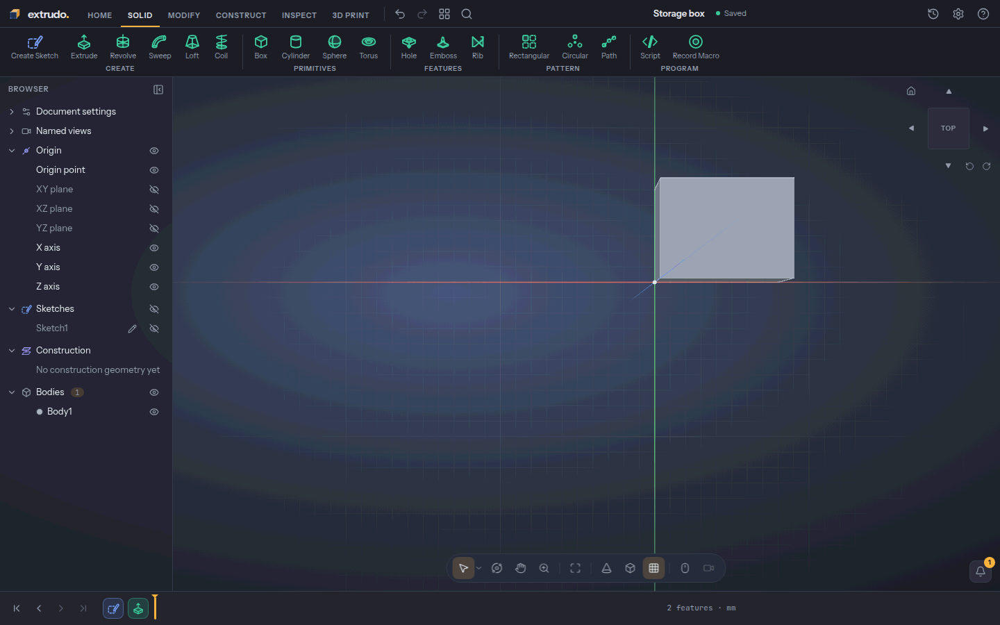

<!-- step: sketch-on-face -->
### 7. Start a sketch on the top face

Now the interesting part: drawing on the solid itself. Press **Create Sketch**
again, and this time click the **top face** of the block instead of a plane. The
view turns to look straight down on the face, and `Sketch2` appears in the
timeline.

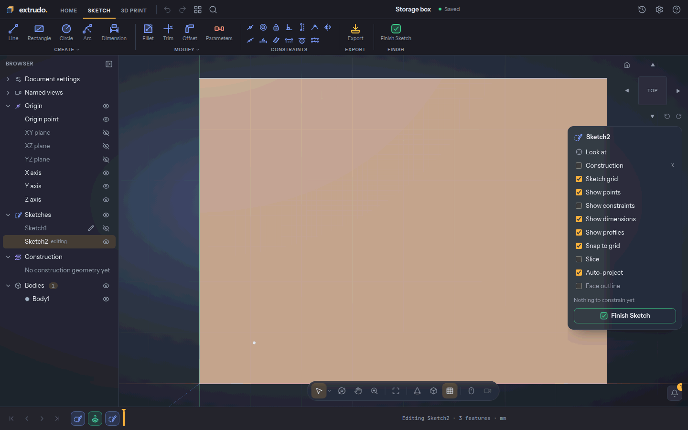

<!-- step: project -->
### 8. Project the face's outline

Press **Project** (or `P`), then click the top face. Extrudo copies the face's
outline into the sketch as its own four lines, in the construct colour. They are
tied to the face, so they move when the box does. Press `Esc` to leave the tool.

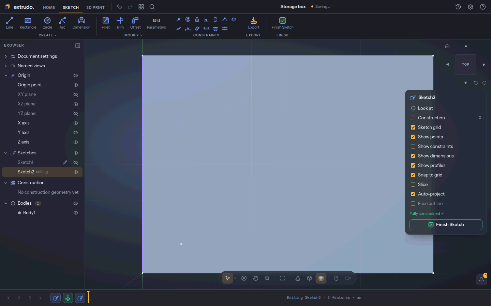

<!-- step: offset -->
### 9. Offset the outline to make the walls

Press **Offset** (or `O`). Click the projected outline, then move the pointer to
the inside and type `3`, the wall thickness. Press `Enter`: a second, smaller
rectangle appears 3 mm inside the first, and the palette now shows **2 profiles**.

Double-click the dimension under the inner rectangle and type `wall` instead of
`3`. All four dimensions follow it, so every wall will be one parameter.

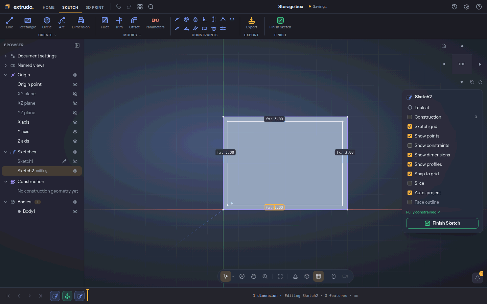

<!-- step: cut -->
### 10. Cut the cavity

Press **Finish Sketch**. Click between the two rectangles to select the inner
profile, and press `E` (**Extrude**). Set **Operation** to **Cut**, type
`-(height - bottom)` in **Distance** and press **OK**. The extrude cuts the
cavity down to the 4 mm floor. `Body1` now has 11 faces: the six outside, four
inner walls and the floor.

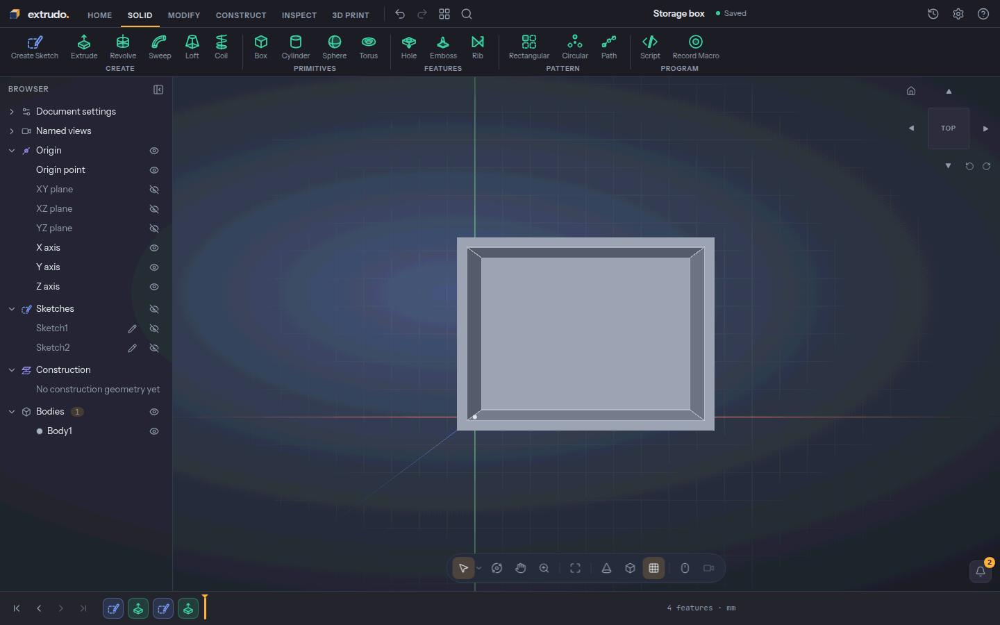

<!-- step: change-parameters -->
### 11. Change a number and watch the walls follow

Open the **Home** tab, press **Parameters** and change `width` to `100 mm`,
`depth` to `70 mm` and `wall` to `4 mm`. Press `Esc`.

The box is wider and deeper, and the walls are thicker, because the offset
sketch follows `wall`. The floor stays 4 mm. `Ctrl+Z` undoes the change if you
prefer the old size.

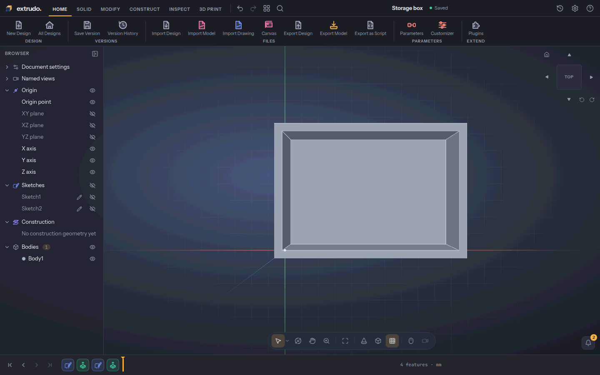

<!-- step: export -->
### 12. Export for printing

Open the **3D Print** tab and press **Export**. Choose **STL**. The summary says
the model is *watertight*, which means a slicer can read it without repair.
Press **Export STL** and the file downloads.

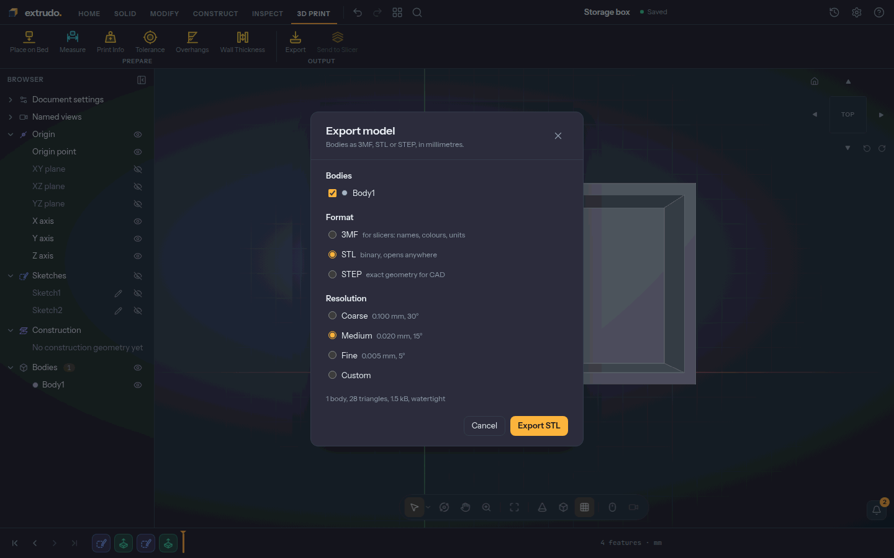

## What you learned

- A sketch can sit on the **top face of a solid**, not only on the origin
  planes.
- **Project** copies a face's outline into a sketch, tied to the model.
- **Offset** grows or shrinks an outline in one step, and its dimension can
  follow a named parameter.
- An **Extrude** can **Cut** a cavity into a body instead of adding material.
- The **timeline** keeps every step, so changing a parameter recomputes the whole
  box from the start.

Related tools: [Parameters](../tools/parameters.md),
[Create Sketch](../tools/sketch.md), [Rectangle](../tools/rectangle.md),
[Dimension](../tools/dimension.md), [Extrude](../tools/extrude.md),
[Project](../tools/project.md), [Offset](../tools/sketchOffset.md) and
[Export](../tools/export.md).

The ideas behind this tutorial are in
[The app in five minutes](../getting-started.md),
[Sketching and constraints](../sketching.md),
[Features and the timeline](../features-and-timeline.md) and
[Parameters and expressions](../parameters.md).
